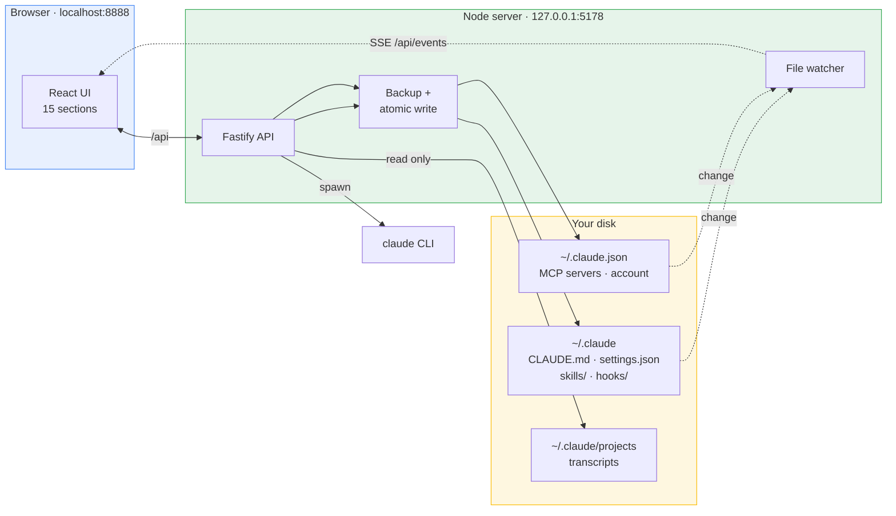
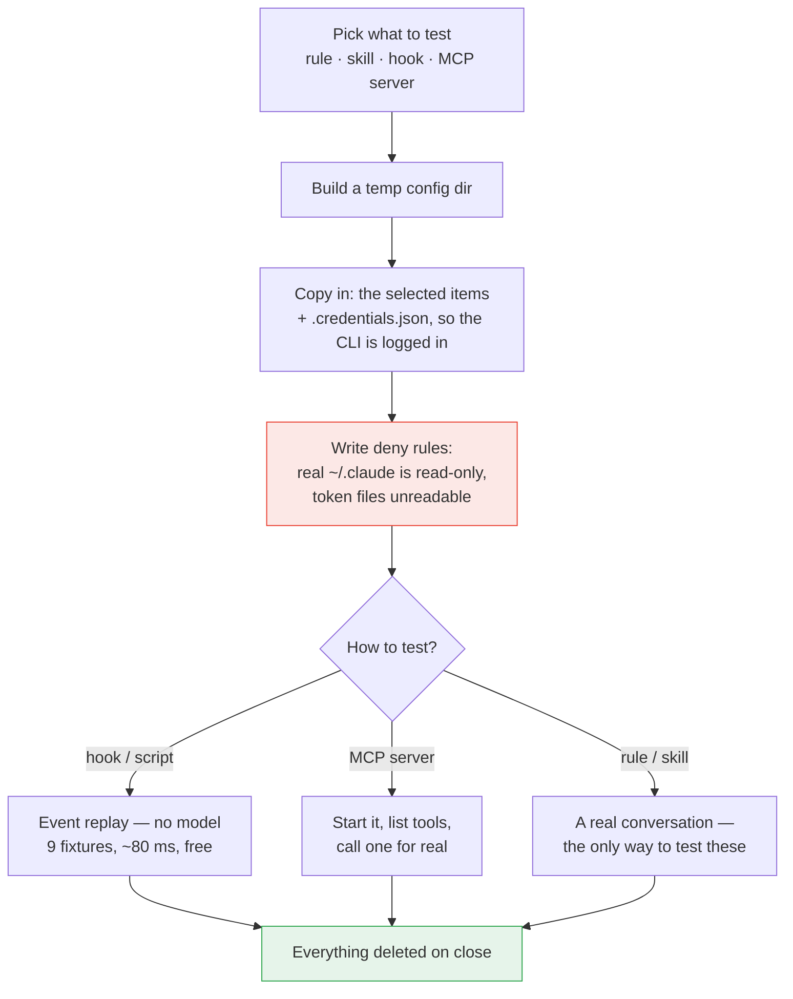
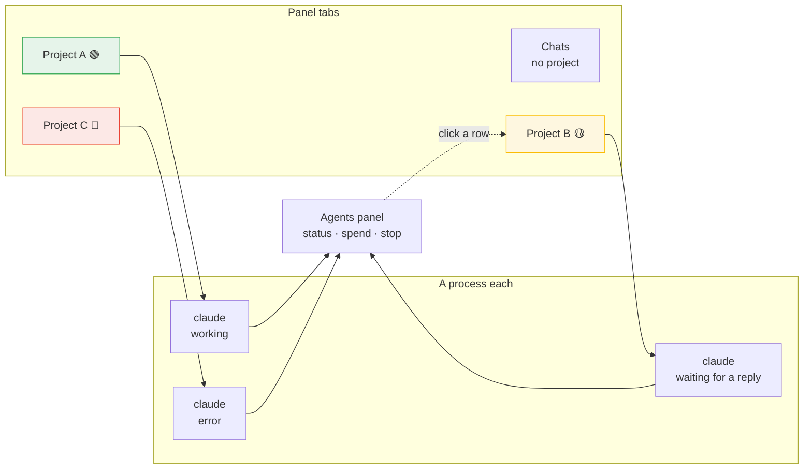

# Claude Control

**Every Claude Code setting in one place.**

A local web panel for the configuration of [Claude Code](https://claude.com/claude-code). It reads and edits the real files on your disk — `CLAUDE.md`, `settings.json`, skills, hooks, MCP servers — through a UI instead of hand-editing JSON and Markdown. It also ships a sandbox for trying a setting out before it touches your everyday setup.

Runs entirely on your machine. No account, no server, no telemetry.

🇷🇺 [Русская версия](README.ru.md) · 🔧 [Setup and troubleshooting](SETUP.md)

> [!TIP]
> **Not starting?** Run `pnpm doctor` — the environment check explains every finding.
> If that does not help, open Claude Code in this folder and say "it won't start, figure it out".
> The root holds [CLAUDE.md](CLAUDE.md), a map of the project written for the agent: it reads
> that automatically and begins with diagnostics rather than with reading the source.

---

## Contents

- [Why](#why)
- [What it does](#what-it-does)
- [How it works](#how-it-works)
- [Where your data lives](#where-your-data-lives)
- [The sandbox](#the-sandbox)
- [Chat and parallel agents](#chat-and-parallel-agents)
- [Security](#security)
- [Quick start](#quick-start)
- [Platform support](#platform-support)
- [Development](#development)
- [Known limitations](#known-limitations)

---

## Why

Claude Code keeps its configuration as loose files in `~/.claude`. That is a good design — it is greppable, diffable and scriptable — but it grows. A mature setup has a thousand-line `CLAUDE.md`, a couple of dozen skill folders, hooks buried three levels deep in `settings.json`, MCP servers in a different file entirely, and permission rules nobody remembers writing.

At that point three ordinary questions get hard to answer:

- _Which rules and skills are actually active right now?_
- _This hook — what does it match, and does it still work?_
- _If I add this rule, what breaks?_

Claude Control answers all three. It gives the configuration a shape you can see, an off switch that does not destroy anything, and a sandbox where you can test a change against the real Claude Code before it becomes your daily setup.

## What it does

<table>
<tr><td width="50%" valign="top">

**Configuration**

- **Rules** — `## RULE:` sections of `CLAUDE.md`, individually searchable and toggleable; a separate page shows and edits the whole `CLAUDE.md`
- **Skills** — the `skills/` folder, with a file tree and editor per skill
- **Hooks** — grouped by lifecycle event, with the matcher shown plainly, reorderable within an event
- **Scripts** — the files in `hooks/`, including nested folders, flagged when nothing calls them
- **MCP servers** — with a real connection check over the MCP protocol: stdio, HTTP and SSE; interactive OAuth sign-in for network ones
- **Permissions** — allow / ask / deny, including `mcp__*` patterns
- **Environment** — from `settings.json` and `.mcp-secrets.env`, secrets masked
- **Plugins** — installed set plus the marketplace catalogue, with sources you can add and remove

</td><td width="50%" valign="top">

**Working with it**

- **Sandbox** — try a rule, skill, hook or MCP server in isolation
- **Chat** — talk to Claude Code from the panel: streaming, attachments, voice, artifact preview, model and effort picker, branching by editing a message, clickable answer options
- **Several projects at once** — project tabs, with agents running in parallel and surviving tab switches
- **Analytics** — token spend and estimated cost, read from your local transcripts, exportable to CSV and JSON
- **Groups** — arbitrary sets of entities, switchable together
- **Automations** — scenarios that compile down to ordinary hooks
- **AI assistant** — describe a rule or skill in words, get the form filled in
- **Help** — a walkthrough of every section with diagrams, in English and Russian
- **Live reload** — the panel follows file changes, including ones Claude Code makes itself
- **Backups** — every write is backed up and atomic

</td></tr>
</table>

### Soft disable

Turning something off never deletes it. A disabled rule moves to a holding section of `CLAUDE.md`, a disabled skill moves to `skills-disabled/`, a disabled MCP server moves to an `mcpServersDisabled` key, and a disabled hook's command is kept in the panel's own state (it must not stay in `settings.json`, or Claude Code would keep running it). The text survives; only Claude Code's view of it changes. That is what makes bisecting a misbehaving setup practical.

A group switches off as a whole: every member goes dark at once and comes back when you switch it on. The group's mark is kept separately from the manual one, so a member you disabled individually will not spring back when the group returns, and a member of two groups only comes back once both have let go of it.

## How it works

There is no database. The panel is a view over the files Claude Code already reads, and edits go back to those same files.



Three things follow from that shape:

**Nothing is cached behind your back.** The panel is not the owner of the configuration — you and Claude Code edit those files too. A watcher (chokidar) sees changes and pushes them to the UI over SSE, so an edit made in your editor shows up in the panel without a refresh.

**Writes are defensive.** Every write goes through a backup into `~/.claude/claude-control/backups/` and lands atomically (write to a temp file, then rename), so an interrupted save cannot leave you with a half-written `settings.json`.

**Restart is honest.** Claude Code reads its configuration at startup. Almost every mutation returns `needsRestart: true`, and the UI says so, rather than pretending the change is already live.

### The AI features use your own subscription

The form assistant, the skill-structure generator and the chat all shell out to the `claude` CLI you already have installed and logged in. There is no API key to configure, and no key is stored anywhere — Claude Code's own credentials are used, by Claude Code.

## Where your data lives

Everything is under your home directory. The panel creates no files inside the repository.

| Path                                  | Access        | What it is                                                  |
| ------------------------------------- | ------------- | ----------------------------------------------------------- |
| `~/.claude/CLAUDE.md`                 | read / write  | Rules                                                       |
| `~/.claude/settings.json`             | read / write  | Hooks, permissions, env                                     |
| `~/.claude/settings.local.json`       | read / write  | Personal hooks, permissions and vars — tagged "local"       |
| `~/.claude/skills/`                   | read / write  | Skills                                                      |
| `~/.claude/skills-disabled/`          | read / write  | Disabled skills                                             |
| `~/.claude/hooks/`                    | read / write  | Hook scripts                                                |
| `~/.claude.json`                      | read / write  | MCP servers, account (note: _beside_ `.claude`, not inside) |
| `~/.claude/.mcp-secrets.env`          | read / write  | MCP secrets                                                 |
| `~/.claude/projects/`                 | **read only** | Transcripts — the source for chat and analytics             |
| `~/.claude/.credentials.json`         | **read only** | Copied into a sandbox so the CLI is logged in               |
| `~/.claude/claude-control/state.json` | read / write  | The panel's own state: groups, automations, settings        |
| `~/.claude/claude-control/backups/`   | write         | Timestamped backups                                         |
| `~/.claude-control/chats/`            | read / write  | Working folders for chats started in the panel              |
| `~/.claude-control/sandboxes/`        | read / write  | Temporary sandbox config and working dirs                   |

The last two sit outside `~/.claude` deliberately: Claude Code treats its own directory as protected and refuses to write there, so artifacts created during a chat would silently fail to appear.

Configuration root discovery, in order: the path set in the panel's Settings → the `CLAUDE_CONFIG_DIR` environment variable → `~/.claude`. If none resolves, the UI asks you for the path instead of guessing.

## The sandbox

The point of the sandbox is to answer "what does this rule actually do?" without making it your daily setup.

Claude Code reads everything from the directory named by `CLAUDE_CONFIG_DIR`. The sandbox builds a temporary directory, puts **only the thing under test** into it, and launches the CLI pointed at that directory.



Measured in such a run: **30 tools instead of 165, zero MCP servers, and not one third-party hook fires.** The only thing carried over from the real directory is `.credentials.json` — without it the CLI answers "Not logged in". `.mcp-secrets.env` is never copied.

A second line of defence is written into the sandbox's own `settings.json`: `~/.claude/**` is denied for writing and the token files are denied for reading. Verified in practice — a prompt asking Claude to read `settings.json` and write `PROBE.txt` into `~/.claude` was refused on both counts, and no file appeared.

Hook and script testing needs no model at all. Nine prepared events (a harmless command, `rm -rf`, `git push`, a secret being written, a placeholder key, and so on) are replayed straight at the script, and the verdict is compared against what the fixture expects. It costs nothing and takes under a tenth of a second, so it is practical to run on every edit.

## Chat and parallel agents

Chat in the panel is not a separate bot and not a wrapper around the API. It launches the very same `claude` you use in the terminal, and the conversation stays in ordinary Claude Code transcripts. A conversation started in the terminal shows up in the panel, and the other way around.

What the panel adds on top of the CLI is concurrency. Each project opens in its own tab and runs its own process; switching tabs does not stop an agent.



**The dot on a tab says what is happening.** Green — the agent is working; yellow — it asked a question and is waiting; red — an error, a rate limit, or a stall: if no events arrive for two minutes the run is treated as broken. A background agent that finishes or gets stuck on a question sends a notification, and clicking it opens that project.

**Edits are allowed by default, and the toggle remembers where you left it.** It used to reset on every reload, which made agents stall over nothing — so now it sticks, and switching to read-only is a deliberate act. Worth checking before you hand a task to an unfamiliar repository. If a run does stall, the header offers **Retry** and **Allow and continue**; the second one re-runs the same request with full access, bypassing both the toggle and the rules in the Permissions section.

**Spending is visible as it happens** — in tokens by default, because on a subscription dollars mean nothing. Switch it to money in the settings if you prefer.

The honest boundary: a run belongs to the server, not to the tab. Closing the tab or pressing F5 only detaches the listener — the agent keeps working, and on return the panel picks the running jobs back up; one that finished while the tab was closed comes back to the feed within a grace minute, and after that stays in the transcript. The session's spend counter is likewise counted on the server and survives a reload. The real boundary is restarting the server itself: the run registry lives in its memory. You answer an agent's question either in text or by clicking one of the offered options.

## Security

The threat model is worth stating plainly, because this tool sits on sensitive files by design: it has full read and write access to `~/.claude`, including `.credentials.json` and `.mcp-secrets.env`, and it can start processes. It is a single-user tool for your own machine — not a multi-user service, and not something to expose.

Within that model, here is what was verified rather than assumed.

### Your keys do not reach git

Checked by dry-running the commit that a contributor would actually make:

- `git add -An --all` stages only source files and notes — no configuration, no credentials.
- History is clean: no `.env`, credential, key or token file has ever been added.
- **The application writes nothing inside the repository.** Every write path resolves under `~/.claude` or `~/.claude-control`; there are no writes relative to `process.cwd()` in the server at all.

One consequence worth knowing: chat attachments now land in the panel's own folder rather than the conversation's working directory. Before, a chat started inside a project could drop an uploaded file straight into your working tree, where the next `git add -A` would pick it up.

### Nothing is sent anywhere

- **No telemetry, no analytics, no error reporting.** Zero references to Sentry, PostHog, Google Analytics, Mixpanel, Segment and the rest — in the code and in the lockfile alike. No external CDN, font or script in the page.
- The **Analytics** section reads your local transcripts and computes everything in memory. It is a log parser, not a reporting client.
- The only outbound requests the server makes go to an MCP server's URL that you configured yourself: an MCP protocol handshake, to see whether it answers and what tools it offers.
- The frontend talks only to its own API on a relative `/api` path.
- Secrets never appear in command-line arguments — prompts go in over stdin, tokens through the environment — so they are not visible in `ps` or Task Manager. There is no logging of secrets anywhere.

Indirect traffic exists and is expected: the `claude` CLI talks to the Anthropic API, `claude plugin` fetches marketplace repositories, and MCP servers do whatever they do. Those are the tools you are already running; the panel just launches them.

### The API is locked to your own UI

The server binds to `127.0.0.1` only, so nothing on your network can reach it. That alone is not enough, though — a request from a page open in _your_ browser already comes from inside the loopback interface. So:

- **CORS is restricted to the panel's own origin** (`localhost:8888` / `127.0.0.1:8888`). Any other origin gets a 403 before the request reaches a route handler.
- A `Sec-Fetch-Site: cross-site` request is rejected too, which covers the forms and image tags that can be sent cross-origin without CORS permission at all.
- Values that end up as CLI arguments (session id, model, chat name, plugin id) are validated against an allowlist rather than escaped, because quoting rules under `cmd.exe` cannot be relied on.

Verified against a live server: a request carrying `Origin: https://evil.example.com` is refused for reading configuration, for reading secrets, and for installing a hook, while the panel itself continues to work normally.

> [!IMPORTANT]
> Do not change the bind address to `0.0.0.0`, put the API behind a reverse proxy or tunnel, or publish the port out of a container. The API has no authentication by design — anyone who can reach it can read your tokens and register a hook, and a hook is a command Claude Code will run.

### Things to know

- Sandboxes under `~/.claude-control/sandboxes/` contain a copy of `.credentials.json` and any MCP server `env` values in plain text. They are removed when you close the sandbox, and any left behind by a crash are swept on the next server start: the sandbox registry lives in memory, so whatever is still on disk at startup belongs to nobody. Folders younger than a minute are left alone, so two servers starting at once do not clear each other's work.
- Backups in `~/.claude/claude-control/backups/` include copies of `.mcp-secrets.env` in plain text. Same directory permissions as the original, no encryption.
- `HookProbe.ts` contains a synthetic, non-functional `glpat-…` string. It is bait used to check that a secret-blocking hook actually fires. It is not a leak, but GitHub secret scanning will flag it.

## Quick start

**Requirements:** Node.js 22.6+ (for TypeScript type stripping), pnpm 10+, and the `claude` CLI installed, logged in, and on your `PATH`.

```bash
pnpm install
pnpm dev
```

The panel opens at **http://localhost:8888**. The API runs on **127.0.0.1:5178**.

Anything unexpected — a port in use, an empty configuration directory, plugins not listing — is covered in **[SETUP.md](SETUP.md)**, along with where `.claude` lives on each OS and how to get the panel working again.

## Platform support

The core is portable: the home directory is always resolved through `os.homedir()`, paths through `path.join`, and text parsing tolerates both `\n` and `\r\n`.

|                                | Windows           | Linux         | macOS         |
| ------------------------------ | ----------------- | ------------- | ------------- |
| Panel, configuration editing   | ✅                | ✅            | ✅            |
| Chat, sandbox, assistant       | ✅                | ✅            | ✅            |
| MCP connection check           | ✅                | ✅            | ✅            |
| Running agents in Analytics    | ⚠️                | ⚠️            | ⚠️            |
| `.ps1` hook scripts in sandbox | ✅                | ⚠️ needs pwsh | ⚠️ needs pwsh |
| `.sh` hook scripts in sandbox  | ⚠️ needs Git Bash | ✅            | ✅            |

⚠️ **Running agents** is a best-effort panel: agents are matched by their command line, because a CLI installed through npm runs under the name `node`, not `claude`. If listing processes is not permitted, the section simply stays empty.

Sandbox fixtures use example paths in the style of whichever system the panel runs on, and the filesystem MCP preset fills in your home directory.

## Development

```
apps/
  server/     Fastify API · TypeScript run directly by Node, no build step
  web/        React 19 + Vite · FSD layout, SCSS modules
packages/
  contracts/  Shared zod schemas and types
tools/qa/     Playwright scripts — screenshots, layout audit, flow checks
```

| Command           | What it does                                                 |
| ----------------- | ------------------------------------------------------------ |
| `pnpm dev`        | Server and frontend together                                 |
| `pnpm check`      | The full gate: format, types, lint, module boundaries, build |
| `pnpm type-check` | TypeScript across all packages                               |
| `pnpm lint`       | ESLint                                                       |
| `pnpm depcruise`  | FSD layer boundaries                                         |
| `pnpm qa:setup`   | Install the Chromium build the QA scripts need (once)        |

QA scripts run against a live panel: `node tools/qa/screenshot.mjs light`, `node tools/qa/audit-layout.mjs`, and so on. Point them elsewhere with `APP_URL`.

The frontend follows Feature-Sliced Design, and the layer boundaries are machine-enforced by dependency-cruiser — imports may only go downward, and cross-feature imports are rejected.

The server has no build step: Node runs the TypeScript sources directly via `--experimental-strip-types`. That is why the Node floor is 22.6 and why constructs needing real compilation (parameter properties, enums) are avoided.

## Known limitations

The full section-by-section breakdown is in [LIMITATIONS.md](LIMITATIONS.md): what is limited, why, and whether it is worth waiting for.

- **Restart required.** Claude Code loads its configuration at startup, so most changes only take effect after you restart it. The UI marks these.
- **Plugins depend on the CLI.** Everything on that page shells out to `claude plugin`; if the CLI cannot reach a marketplace, the panel shows you its raw output rather than inventing a friendlier error.
- **Analytics costs are indicative.** On a subscription you are not billed per token, so treat the number as relative volume, not money owed. The price list is pulled from the Anthropic site and shown in Settings; it excludes discounts, batch rates and negotiated account terms.
- **A restore rewrites the whole file.** Backups are listed in Settings and any of them applies with one click — but it replaces the entire file, not a single entry inside it. The state before the restore is itself saved as a fresh copy.
- **Chat runs live in server memory.** Closing the tab or reloading the page does not touch the agent: the run belongs to the server, and on return the panel picks the running ones back up (one that finished while the tab was closed returns to the feed within a grace minute, and after that only in the transcript). The session's accumulated spend is likewise counted on the server and survives F5. The real boundary is restarting the server: the registry of running processes is held in its memory, so that ends everything.
- **The list of created files exists only for chats outside a project.** Inside a real repository it is deliberately not shown.
- **Editing a hook changes its id.** The id is derived from the content, so a rewritten command is a different hook: a saved link to it stops opening, and its group membership has to be set again.

## License

Not yet specified.
