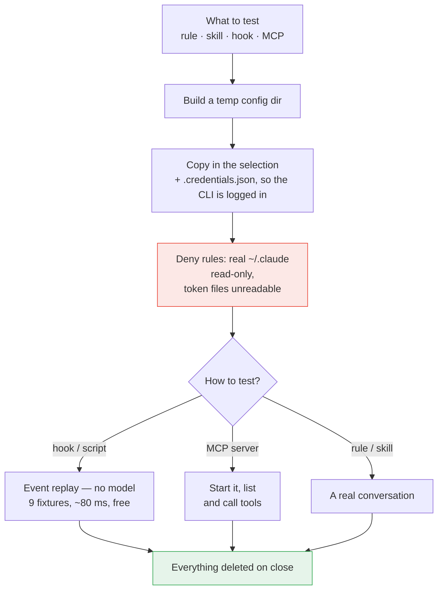

# Claude Control

**Every Claude Code setting in one place.**

A local web panel for [Claude Code](https://claude.com/claude-code): it reads and edits the real files on disk — `CLAUDE.md`, `settings.json`, skills, hooks, MCP servers — through a UI instead of by hand in JSON and Markdown. Plus a sandbox, where a change is tested before it becomes your daily setup.

Runs entirely on your machine: no account, no server, no telemetry.

By default the panel configures Claude Code, where everything is available; it also edits the configuration of Codex, Gemini, Qwen Code, Continue, Goose, Kimi Code, Cursor, OpenCode and Aider — each in its native format, see [CLIs other than Claude](#clis-other-than-claude).

🇷🇺 [Русская версия](README.ru.md) · 🔧 [Setup and troubleshooting](docs/SETUP.md) · 🚫 [What the panel does not do](docs/LIMITATIONS.md)

> [!TIP]
> **Won't start?** `pnpm doctor` explains every finding. Still stuck — open Claude Code in this
> folder and say "it won't start, figure it out": it reads [CLAUDE.md](CLAUDE.md), the map of this
> project written for the agent, and starts with diagnostics rather than with the code.

---

## Why

Claude Code's configuration is plain files, which is a good decision while there are few of them. Then comes a thousand-line `CLAUDE.md`, dozens of skill folders, hooks three levels deep in `settings.json`, MCP servers in a different file altogether, permissions nobody remembers adding. Three simple questions get hard: **what is actually active right now, what does this hook fire on, what breaks if I add this rule.**

The panel answers them: a visible shape, a switch that deletes nothing, and a sandbox where a change is tested against real Claude Code before it becomes permanent.

## What it does

<table>
<tr><td width="50%" valign="top">

**Configuration**

- **Rules** — the `## ПРАВИЛО:` sections of `CLAUDE.md`, each with search and its own switch; a separate page edits the whole file
- **Skills** — the `skills/` folder: file tree, editor, rename, a library of `SKILL.md` templates
- **Commands** — everything invoked through `/` in one list: skills, command files, plugins, built-in CLI commands — with a description, an owner and a jump to editing
- **Hooks** — grouped by event, matcher shown explicitly, order within an event rearranged by hand
- **Scripts** — files from `hooks/`, nested folders included, with a flag on the ones nothing calls
- **MCP servers** — a real protocol-level connection check (stdio, HTTP, SSE), interactive OAuth login, a tool listing, and `mcp__server__tool` permissions generated from it
- **Permissions** — allow / ask / deny, `mcp__*` patterns included; entries move between `settings.json` and `settings.local.json`
- **Environment** — from `settings.json` and `.mcp-secrets.env`, secrets masked
- **Plugins** — installed ones and the marketplace catalog, source management, a scaffolder for your own
- **Projects** — the project level of a chosen folder (`CLAUDE.md`, `.mcp.json`, `.claude/settings.json`) on top of the user level

</td><td width="50%" valign="top">

**Working with it**

- **Sandbox** — test a rule, skill, hook or MCP server in isolation; a hook against a prepared or custom JSON event
- **Chat** — a conversation with Claude Code inside the panel: streaming, attachments, voice, artifact preview, model and thinking depth, branching by editing a message, search, export to md/json
- **Several projects at once** — tabs, parallel agents, dev servers launched from the tab: one target per package in a monorepo, each on its own port, autostarted when the panel boots
- **Project git** — current branch, the list of changed files, switching, creating a branch, committing and `pull` right from the tab; the section shows up only when the project has a `.git`
- **Search** — one query across rules, skills, hooks, scripts, permissions, env, MCP and plugins (secret values are never revealed)
- **History** — a line-by-line diff over the backups, rollback of a whole file or of a single hunk
- **Analytics** — token spend and estimated cost from local transcripts: hour heatmap, cache share, CSV/JSON export
- **Groups** — arbitrary sets of entities toggled together, nestable
- **Automations** — compiled down to ordinary hooks
- **AI assistant** — describe a rule or skill in words, get a filled-in form
- **Environment transfer** — pack any provider's environment (instructions, MCP, permissions, hooks, skills, plugins) into an archive and unpack it on another machine with a new / identical / will-overwrite plan
- **Provider comparison** — two CLIs side by side, row by row per section, with MCP servers and instructions carried from one into the other
- **Model catalog** — the panel finds out which models the active provider has released and moves the default onto the newer generation of the same family
- **Your own endpoint** — a model address instead of the vendor cloud (a local model, a company gateway, a proxy): the profile is entered once and spread across the CLI's environment variables with one button; by default the token is not written into a foreign config
- **Data protection** — a local proxy between the CLI and the model: it sees every request body (the prompt, files the agent read, tool output), replaces matches with an `[ИМЯ_1]` placeholder and restores them in the reply, or refuses the request outright; it finds exactly what the rules describe
- **Prompt gate** — a ready-made `UserPromptSubmit` hook on the same rules: it rejects or flags a prompt before it is sent, with no proxy; it sees only what a human typed and cannot rewrite the text — the event does not allow it
- **Help** — every section explained with diagrams and examples, in Russian and English
- Plus the ordinary: Ctrl/Cmd+K, live file watching (edits by Claude Code show up without a refresh), a backup before every write

</td></tr>
</table>

### Disabling is soft

Disabling never deletes: a rule moves into a service section of `CLAUDE.md`, a skill into `skills-disabled/`, an MCP server under the `mcpServersDisabled` key, a hook's command into the panel's own state (it must not stay in `settings.json`, or Claude Code would keep running it). The text stays where it was; only what Claude Code sees changes — which is exactly what makes bisecting for the culprit possible.

A group toggles as a whole. The group mark is stored separately from the manual one: a member you disabled by hand does not come back when the group is enabled, and a member of two groups returns only when both release it.

## How it works

There is no database. The panel is a view over the files Claude Code already reads, and edits go back to those same files.


Three things follow:

- **Nothing is cached behind your back.** You and Claude Code edit those same files; a watcher (chokidar) pushes changes to the UI over SSE, so an edit made in your editor shows up without a refresh.
- **Writes are defensive.** A backup into `~/.claude/claude-control/backups/`, then an atomic write through a temp file — an interrupted save cannot leave a half-written `settings.json`.
- **Restart is honest.** Claude Code reads its configuration at startup, so almost every mutation returns `needsRestart: true` and the UI says so.

The AI features (form assistant, skill generator, chat) shell out to the `claude` CLI you already have installed and logged in. No API key to configure, none stored anywhere.

## Where your data lives

Everything is under your home directory. The panel creates no files inside the repository.

| Path                                  | Access        | What it is                                                  |
| ------------------------------------- | ------------- | ----------------------------------------------------------- |
| `~/.claude/CLAUDE.md`                 | read / write  | Rules                                                       |
| `~/.claude/settings.json`             | read / write  | Hooks, permissions, env                                     |
| `~/.claude/settings.local.json`       | read / write  | The same, personal — tagged "local"                         |
| `~/.claude/skills/`                   | read / write  | Skills                                                      |
| `~/.claude/skills-disabled/`          | read / write  | Disabled skills                                             |
| `~/.claude/hooks/`                    | read / write  | Hook scripts                                                |
| `~/.claude.json`                      | read / write  | MCP servers, account (note: _beside_ `.claude`, not inside) |
| `~/.claude/.mcp-secrets.env`          | read / write  | MCP secrets                                                 |
| `~/.claude/projects/`                 | **read only** | Transcripts — the source for chat and analytics             |
| `~/.claude/.credentials.json`         | **read only** | Copied into a sandbox so the CLI is logged in               |
| `~/.claude/claude-control/state.json` | read / write  | The panel's own state: groups, automations, settings        |
| `~/.claude/claude-control/backups/`   | write         | Timestamped backups                                         |
| `~/.claude-control/chats/`            | read / write  | Working folders for chats started in the panel              |
| `~/.claude-control/sandboxes/`        | read / write  | Temporary sandbox config and working dirs                   |

The last two sit outside `~/.claude` deliberately: Claude Code treats its own directory as protected and refuses to write there, so chat artifacts would silently fail to appear.

Configuration root discovery, in order: the path set in the panel's Settings → `CLAUDE_CONFIG_DIR` → `~/.claude`. If none resolves, the UI asks instead of guessing.

## The sandbox

Answering "what does this rule actually do?" without making it your daily setup.

Claude Code reads everything from the directory named by `CLAUDE_CONFIG_DIR`. The sandbox builds a temporary directory, puts **only the thing under test** into it, and launches the CLI pointed at that directory.



Measured in such a run: **30 tools instead of 165, zero MCP servers, and not one third-party hook fires.** The only thing carried over from the real directory is `.credentials.json` — without it the CLI answers "Not logged in"; `.mcp-secrets.env` is never copied.

A second line of defence is the sandbox's own `settings.json`: `~/.claude/**` denied for writing, token files denied for reading. Verified in practice — a prompt asking Claude to read `settings.json` and write `PROBE.txt` into `~/.claude` was refused on both counts, and no file appeared.

Hooks and scripts are tested with no model at all: nine prepared events (a harmless command, `rm -rf`, `git push`, a secret being written, and so on) are replayed straight at the script and the verdict compared against what the fixture expects. Free, under a tenth of a second — practical to run on every edit.

## Chat and parallel agents

Not a separate bot and not an API wrapper: the same `claude` you run in the terminal, with the conversation kept in ordinary Claude Code transcripts. A chat started in the terminal shows up in the panel, and the other way round.

What the panel adds is concurrency: each project gets its own tab and its own process, and switching tabs does not stop an agent.

- **The dot on the tab.** Green — working, yellow — waiting on an answer, red — an error, a limit, or a stall (two minutes without events). A background agent that finished or hit a question sends a notification; clicking it opens that project.
- **Edits are allowed by default,** and the toggle remembers its position — check it before handing a task to an unfamiliar repository. A stalled run offers "Retry" and "Allow and continue"; the second replays the request with full access, bypassing both the toggle and the Permissions section.
- **Spend is visible immediately** — in tokens by default, because on a subscription dollars mean nothing; switch to money in Settings.
- **A project tab is its dev server too.** "Start" takes the command from `package.json` (`dev`, otherwise `start`) or your own and runs it with the package manager the project actually uses — pnpm, yarn or npm, read from `packageManager` and the lock file. **The panel does not assign the port:** the app comes up on its own, and the panel reads the address from the output, opening the browser once the port answers. A monorepo has several targets — the gear lists the root and the packages, and they run at the same time. If a port is taken, the panel shows who holds it (name and PID) and offers to free it; it kills nothing on its own. "Autostart" brings a target up on the panel's _next_ start, **with no browser window and no navigation**; close the tab and it clears on all targets.
- **Branch, files, commit and pull right there,** whenever the project has a `.git` (no `.git`, no section at all): the button carries the current branch, the number of changed files and how far behind the remote you are; under it sit the changed files, the local branches, the `pull` row, a new-branch field and a commit message field. `pull` goes into the current branch through its upstream, or from a chosen remote branch; it is the only operation that reaches the network and may merge — the panel neither resolves nor rolls back a conflict, git’s own text reaches you as is. No `push`, no branch deletion: this is not a git client, only what you need while an agent works in the repository. Under the hood: `git` with no shell, branch names validated by `git check-ref-format`, checkout and pull limited to names on the list, so a stray ref cannot walk HEAD into detached state.
- **A run belongs to the server, not to the tab.** Closing the tab or hitting F5 only detaches a listener; the panel re-attaches to live runs, and a run that finished while the tab was closed makes it back into the feed within a grace minute, after which it lives only in the transcript. Session spend is counted server-side too. The real boundary is a server restart: the run registry lives in its memory.

## CLIs other than Claude

The panel grew out of Claude Code and stays its tool: **the Claude provider is active by default, and everything is available for it.** Neighbouring agent CLIs are configured the same way — an instructions file, MCP servers, environment variables, an approval policy — and the panel edits those files directly, each in its native format. One UI instead of remembering that Codex keeps MCP in TOML, Gemini in JSON, OpenCode under a different key, and Aider writes env as a YAML list.

### Choosing a provider

**Settings → Configuration provider** (the same optional step exists in first-run onboarding). The "installed" / "config found" / "not found" badge is a hint, never coercion: the provider never switches on its own, the default stays `claude`, and writes happen only on your explicit action. No CLI on `PATH` — the configuration is still editable, and the assistant with neither CLI nor key offers instructions. After a switch the menu keeps exactly what that CLI supports.

### The map: section × provider

**✅ works** · **👁 read-only** — the section is there, but the panel never writes into it (why — in the footnote) · **🧪 experimental** · **— unsupported**, section hidden.

|                                     | Claude | Codex | Gemini | Qwen | Continue | Goose | Kimi | Cursor | OpenCode | Aider |
| ----------------------------------- | :----: | :---: | :----: | :--: | :------: | :---: | :--: | :----: | :------: | :---: |
| Global instructions<sup>1</sup>     |   ✅   |  ✅   |   ✅   |  ✅  |    —     |  ✅   |  ✅  |  ✅ *  |    ✅    | ✅ *  |
| MCP servers<sup>2</sup>             |   ✅   |  ✅   |   ✅   |  ✅  |    ✅    |  ✅   |  ✅  |   ✅   |    ✅    |   —   |
| Environment<sup>3</sup>             |   ✅   |  ✅   |   ✅   |  ✅  |    ✅    |   —   |  —   |   —    |    —     |  ✅   |
| Permissions / approvals<sup>4</sup> |   ✅   |  ✅   |   ✅   |  ✅  |    ✅    |  ✅   |  ✅  |   ✅   |    ✅    |   —   |
| Chat<sup>5</sup>                    |   ✅   |  🧪   |   🧪   |  🧪  |    🧪    |  🧪   |  🧪  |   —    |    🧪    |  🧪   |
| Rules (`## ПРАВИЛО:`)               |   ✅   |   —   |   —    |  —   |    —     |   —   |  —   |   —    |    —     |   —   |
| Skills<sup>10</sup>                 |   ✅   |   —   |   —    |  ✅  |    —     |   —   |  ✅  |   —    |    ✅    |   —   |
| Commands<sup>11</sup>               |   👁    |   —   |   👁    |  👁   |    —     |   —   |  —   |   —    |    👁     |   —   |
| Hooks<sup>8</sup>                   |   ✅   |   —   |   —    |  ✅  |    —     |   —   |  ✅  |   —    |    👁     |   —   |
| Scripts<sup>6</sup>                 |   ✅   |  ✅   |   ✅   |  ✅  |    ✅    |  ✅   |  ✅  |   ✅   |    ✅    |  ✅   |
| Plugins<sup>9</sup>                 |   ✅   |   —   |   —    |  —   |    —     |   —   |  👁   |   —    |    ✅    |   —   |
| Projects<sup>7</sup>                |   ✅   |  ✅   |   ✅   |  ✅  |    ✅    |  ✅   |  ✅  |   ✅   |    ✅    |  ✅   |
| Analytics (tokens, cost)            |   ✅   |   —   |   —    |  —   |    —     |   —   |  —   |   —    |    —     |   —   |
| Sandbox                             |   ✅   |   —   |   —    |  —   |    —     |   —   |  —   |   —    |    —     |   —   |

**Overview, Search, Groups, History, Settings and Help are always there** — those are the panel's own sections. History and search do follow the active provider's files: foreign backups are named separately and never mix with Claude's.

What each footnote stands for — the file path, the keys the panel edits, the reason behind the status — is in [Providers: format details](docs/PROVIDERS.md).

Claude is marked **verified**: its path has been exercised live and is covered by tests. The rest are **experimental**: formats come from each CLI's documentation and are covered by round-trip tests, but the first real write is worth eyeballing. Which is why four tools surround them — a write preview, a provider check on your machine, a daily comparison against the published schemas, and migration of settings between CLIs ([Providers: panel-side tools](docs/PROVIDER-TOOLS.md)). Not theory: the very first format check found a drift — `experimental.hook` is gone from the OpenCode schema, so hooks there are read-only as a fact rather than a guess.

### Your subscription outranks a paid API

The assistant picks what to run in a hard order, locked by tests: **the provider's CLI on `PATH`** (your subscription, nothing extra to pay) → **an API key, only if no CLI was found** → **a modal explaining how to log in**. A stored key never overrides the CLI.

Keys you do enter are stored encrypted (AES-256-GCM) in `claude-control/provider-keys.enc`, with the passphrase in a machine-local `0600` file. Only an `sk-…1234` mask leaves the server. Keys never reach logs, backups, history, search or the exported environment archive — there is a test iterating every provider for that.

### What protects a foreign config

- **A backup before every write, and the write is atomic.** Provider backups are named `<provider>-<file>` and can never roll back over Claude's.
- **Formats come from documentation, not from memory.** Nothing undocumented exists here — neither a format nor a directory override (`CODEX_HOME`, `XDG_CONFIG_HOME` and `OPENCODE_CONFIG` for OpenCode, `QWEN_HOME` are honoured).
- **Validation before write, plus round-trip:** the file is read, changed, serialized back and compared with what was read. Mismatch — no write.
- **Surgical edits.** Codex: only the relevant region of `config.toml` changes, comments, profiles and key order stay byte-for-byte; Aider's YAML keeps its comments; `CRLF`/`LF` is preserved and a BOM is stripped on read and restored on write.
- **Fail-closed.** An unfamiliar or broken file is no reason to guess: the section returns an error and stays read-only. An unsupported capability simply has no section.

## Security

The tool sits on sensitive files by construction: full access to `~/.claude`, including `.credentials.json` and `.mcp-secrets.env`, plus the ability to spawn processes. It is a single-user tool for your own machine — not a service, not something you expose. Within that model, verified:

**Your keys do not reach git.** A dry run of the commit a contributor would make: `git add -An --all` picks up sources only, the history is clean, and the app writes nothing inside the repository at all — every write path leads to `~/.claude` or `~/.claude-control`. One consequence: chat attachments live in the panel's own folder, so `git add -A` will not sweep them up.

**Nothing is sent anywhere.** No telemetry, no analytics, no error reporting — zero mentions of Sentry, PostHog, GA, Mixpanel or Segment in the code and the lock file; no CDN, no external font, no third-party script on the page. Analytics reads your local transcripts and computes in memory. The server's only outbound request is the MCP handshake with a server you configured yourself. Secrets never reach command-line arguments (the prompt goes through stdin, tokens through the environment), so they are invisible in `ps`. Indirect traffic is expected: `claude` talks to the Anthropic API, `claude plugin` fetches marketplaces, MCP servers do what they do.

**The API is closed to everything but your own UI.** Listening on `127.0.0.1` alone is not enough — a request from a page in your browser already comes from inside the loopback. So CORS is restricted to the panel's own origin (`localhost:8888` / `127.0.0.1:8888`, anything else gets 403 before the handler), requests marked `Sec-Fetch-Site: cross-site` are rejected (that covers forms and `` tags aimed at foreign addresses), and values that end up in CLI arguments (session id, model, chat name, plugin id) are checked against an allowlist rather than escaped — `cmd.exe` quoting rules cannot be trusted. Verified against a live server: with a foreign `Origin`, reading configuration, reading secrets and installing a hook are all refused.

> [!IMPORTANT]
> Do not change the listen address to `0.0.0.0`, do not put the API behind a reverse proxy or tunnel, do not publish the port from a container. The API has no authentication by design: whoever reaches it reads your tokens and installs a hook — and a hook is a command Claude Code will run itself.

**Worth knowing.** Sandboxes under `~/.claude-control/sandboxes/` hold a copy of `.credentials.json` and MCP `env` values in plain text; they are deleted on close, and ones abandoned after a crash are swept at the next server start (folders younger than a minute are left alone so two servers starting at once do not fight). Backups of `.mcp-secrets.env` are plain text too, with the original's permissions. `HookProbe.ts` contains a synthetic, non-working `glpat-…` string — bait for verifying that the secret-blocking hook fires. It is not a leak, but GitHub secret scanning will react to it.

## Quick start

**Requirements:** Node.js 22.6+ (for TypeScript type stripping), pnpm 10+, and the `claude` CLI installed, logged in, and on your `PATH`.

```bash
pnpm install
pnpm dev
```

The panel opens at **http://localhost:8888**, the API runs on **127.0.0.1:5178**.

Anything unexpected — a port in use, an empty configuration directory, plugins not listing — is covered in **[SETUP.md](docs/SETUP.md)**, along with where `.claude` lives on each OS.

## Platform support

The core is portable: the home directory is always resolved through `os.homedir()`, paths through `path.join`, and text parsing tolerates both `\n` and `\r\n`.

|                                | Windows           | Linux         | macOS         |
| ------------------------------ | ----------------- | ------------- | ------------- |
| Panel, configuration editing   | ✅                | ✅            | ✅            |
| Chat, sandbox, assistant       | ✅                | ✅            | ✅            |
| MCP connection check           | ✅                | ✅            | ✅            |
| Running agents in Analytics    | ⚠️                | ⚠️            | ⚠️            |
| `.ps1` hook scripts in sandbox | ✅                | ⚠️ needs pwsh | ⚠️ needs pwsh |
| `.sh` hook scripts in sandbox  | ⚠️ needs Git Bash | ✅            | ✅            |

⚠️ **Running agents** is best-effort: agents are matched by their command line, because a CLI installed through npm runs under the name `node`, not `claude`. If listing processes is not permitted, the section stays empty.

## Development

```
apps/
  server/     Fastify API · TypeScript run directly by Node, no build step
  web/        React 19 + Vite · FSD layout, SCSS modules
packages/
  contracts/  Shared zod schemas and types
tools/qa/     Playwright scripts — screenshots, layout audit, flow checks
```

| Command           | What it does                                                 |
| ----------------- | ------------------------------------------------------------ |
| `pnpm dev`        | Server and frontend together                                 |
| `pnpm check`      | The full gate: format, types, lint, module boundaries, build |
| `pnpm type-check` | TypeScript across all packages                               |
| `pnpm lint`       | ESLint                                                       |
| `pnpm depcruise`  | FSD layer boundaries                                         |
| `pnpm qa:setup`   | Install the Chromium build the QA scripts need (once)        |

QA scripts run against a live panel (`node tools/qa/audit-layout.mjs` and friends); point them elsewhere with `APP_URL`. FSD layer boundaries are machine-enforced by dependency-cruiser: imports only go downward, cross-feature imports are rejected. The server has no build step — Node runs TypeScript via `--experimental-strip-types`, which is why the Node floor is 22.6 and constructs needing real compilation (parameter properties, enums) are avoided.

## Known limitations

The full section-by-section breakdown is in [LIMITATIONS.md](docs/LIMITATIONS.md).

- **A restart is needed.** Claude Code loads its configuration at startup; the UI marks such changes.
- **Plugins depend on the CLI.** The page wraps `claude plugin`: if the CLI cannot reach a marketplace, the panel shows its raw output.
- **Cost is indicative.** A subscription is not billed per token, so read the number as volume of work. Pricing comes from Anthropic's site; discounts, batch rates and account-specific terms are not in it.
- **Chat runs live in the server's memory** — restarting it ends them (details above).
- **Editing a hook changes its id:** the id is derived from its content, so a saved link stops resolving and group membership has to be set again.

## License

[PolyForm Perimeter 1.0.1](LICENSE) — use, modify and redistribute it freely, at home and at work,
inside a company and in commercial projects; keep the required notice. The one thing the license
withholds is building a product that competes with this one. The software comes with no warranty.

This is a source-available licence, not an OSI-approved open-source one. Earlier commits carried an
MIT `LICENSE`; that grant stays with the snapshots that shipped it.
