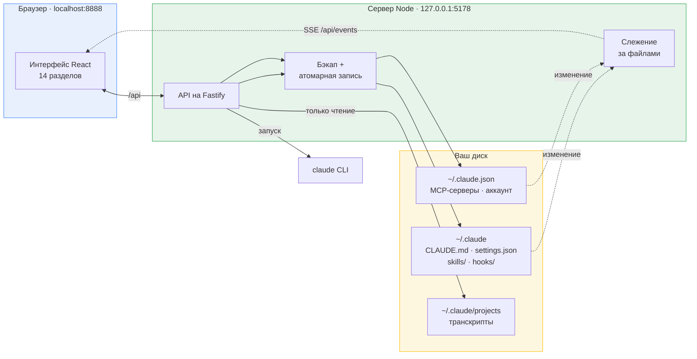
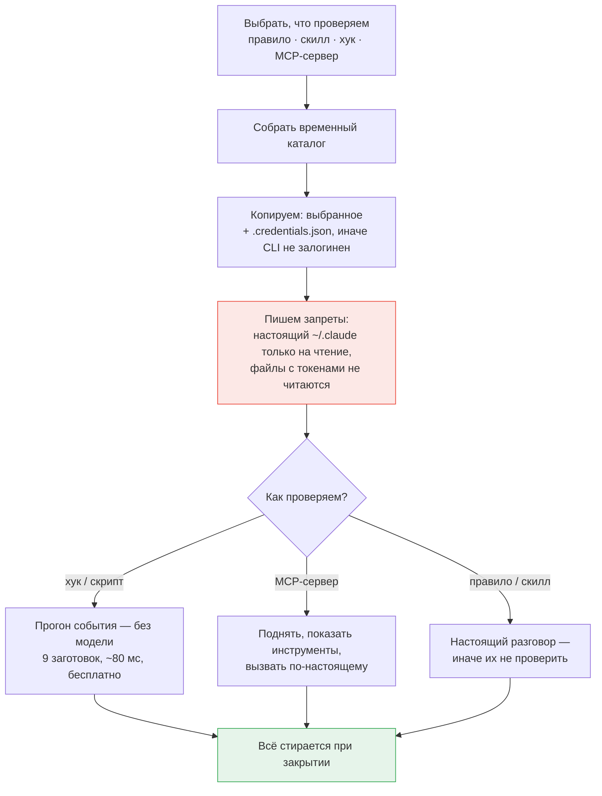
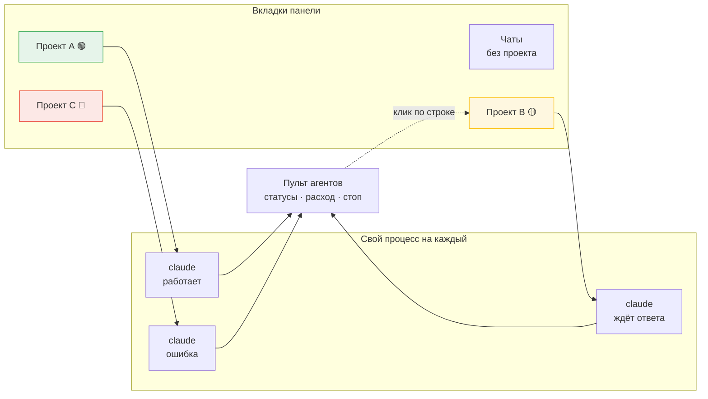

# Claude Control

**Все настройки Claude Code в одном месте.**

Локальная веб-панель для конфигурации [Claude Code](https://claude.com/claude-code). Читает и правит настоящие файлы на диске — `CLAUDE.md`, `settings.json`, скиллы, хуки, MCP-серверы — через интерфейс, а не руками в JSON и Markdown. Плюс песочница: настройку можно проверить до того, как она станет вашей повседневной.

Работает целиком на вашей машине. Без аккаунта, без сервера, без телеметрии.

🇬🇧 [English version](README.md) · 🔧 [Установка и починка](SETUP.ru.md)

> [!TIP]
> **Не запускается?** Выполните `pnpm doctor` — проверка окружения объяснит каждую находку.
> Если не помогло, откройте в этой папке Claude Code и скажите: «не запускается, разберись».
> В корне лежит [CLAUDE.md](CLAUDE.md) — карта проекта для агента: он прочитает её
> автоматически и начнёт с диагностики, а не с чтения кода.

---

## Содержание

- [Зачем](#зачем)
- [Что умеет](#что-умеет)
- [Как устроено](#как-устроено)
- [Где лежат данные](#где-лежат-данные)
- [Песочница](#песочница)
- [Чат и параллельные агенты](#чат-и-параллельные-агенты)
- [Безопасность](#безопасность)
- [Быстрый старт](#быстрый-старт)
- [Поддержка систем](#поддержка-систем)
- [Разработка](#разработка)
- [Известные ограничения](#известные-ограничения)

---

## Зачем

Claude Code хранит конфигурацию обычными файлами в `~/.claude`. Это удачное решение — по ним работает grep, они ложатся в diff и правятся скриптом, — но они разрастаются. У сложившейся настройки `CLAUDE.md` на тысячу строк, пара десятков папок скиллов, хуки на третьем уровне вложенности `settings.json`, MCP-серверы вообще в другом файле и права, которые никто не помнит когда добавлял.

С этого момента три обычных вопроса становятся трудными:

- _Какие правила и скиллы сейчас реально работают?_
- _Вот этот хук — на что он срабатывает и работает ли ещё?_
- _Если я добавлю это правило, что сломается?_

Claude Control отвечает на все три. Он даёт конфигурации видимую форму, выключатель, который ничего не разрушает, и песочницу, где изменение проверяется на настоящем Claude Code до того, как станет постоянным.

## Что умеет

<table>
<tr><td width="50%" valign="top">

**Конфигурация**

- **Правила** — разделы `## ПРАВИЛО:` из `CLAUDE.md`, с поиском и выключателем у каждого
- **Скиллы** — папка `skills/`, у каждого дерево файлов и редактор
- **Хуки** — сгруппированы по событию, matcher показан явно
- **Скрипты** — файлы из `hooks/`, с пометкой, если их никто не вызывает
- **MCP-серверы** — с настоящей проверкой связи по протоколу MCP: stdio, HTTP и SSE
- **Права** — allow / ask / deny, включая шаблоны `mcp__*`
- **Переменные** — из `settings.json` и `.mcp-secrets.env`, секреты замаскированы
- **Плагины** — установленные и каталог маркетплейсов

</td><td width="50%" valign="top">

**Работа с этим**

- **Песочница** — проверить правило, скилл, хук или MCP-сервер в изоляции
- **Чат** — разговор с Claude Code прямо в панели: стриминг, вложения, голос, предпросмотр артефактов
- **Несколько проектов сразу** — вкладки проектов, агенты работают параллельно и не гаснут при переключении
- **Аналитика** — расход токенов и оценочная стоимость по локальным транскриптам
- **Группы** — произвольные наборы сущностей, переключаются вместе
- **Сценарии** — автоматизации, которые компилируются в обычные хуки
- **AI-помощник** — описать правило или скилл словами и получить заполненную форму
- **Справка** — разбор каждого раздела со схемами, на русском и английском
- **Живое обновление** — панель следит за файлами, включая правки самого Claude Code
- **Резервные копии** — перед каждой записью, запись атомарная

</td></tr>
</table>

### Мягкое выключение

Выключение никогда не удаляет. Выключенное правило уезжает в служебный раздел `CLAUDE.md`, скилл — в `skills-disabled/`, MCP-сервер — в ключ `mcpServersDisabled`, команда выключенного хука сохраняется в состоянии панели (в самом `settings.json` её быть не должно — иначе Claude Code продолжит её выполнять). Текст остаётся на месте, меняется только то, что видит Claude Code. Ровно это и делает возможным поиск виновника методом деления пополам.

Группа выключается целиком: гаснут все её участники разом, включение возвращает их обратно. Групповая отметка живёт отдельно от ручной, поэтому участник, выключенный вами по отдельности, при включении группы не оживёт, а участник двух групп вернётся, только когда его отпустят обе.

## Как устроено

Базы данных нет. Панель — это представление тех же файлов, которые читает сам Claude Code, и правки уходят обратно в них же.



Из такого устройства следует три вещи:

**Ничего не кэшируется у вас за спиной.** Панель не владеет конфигурацией — те же файлы правите вы сами и правит Claude Code. Слежение (chokidar) замечает изменения и присылает их в интерфейс через SSE, поэтому правка из редактора появляется в панели без перезагрузки страницы.

**Запись защищена.** Каждая запись проходит через резервную копию в `~/.claude/claude-control/backups/` и выполняется атомарно — сначала во временный файл, потом переименование. Прерванное сохранение не оставит вас с недописанным `settings.json`.

**Про перезапуск говорится честно.** Claude Code читает конфигурацию при старте. Почти каждое изменение возвращает `needsRestart: true`, и интерфейс это показывает, а не делает вид, что правка уже действует.

### AI-возможности работают на вашей подписке

Помощник форм, генератор структуры скилла и чат запускают тот самый `claude` CLI, который у вас уже установлен и залогинен. Отдельный API-ключ заводить не нужно, и нигде он не хранится: используются собственные учётные данные Claude Code — им же самим.

## Где лежат данные

Всё — в домашнем каталоге. Внутри репозитория панель не создаёт ни одного файла.

| Путь                                  | Доступ            | Что это                                                                  |
| ------------------------------------- | ----------------- | ------------------------------------------------------------------------ |
| `~/.claude/CLAUDE.md`                 | чтение / запись   | Правила                                                                  |
| `~/.claude/settings.json`             | чтение / запись   | Хуки, права, переменные                                                  |
| `~/.claude/settings.local.json`       | чтение / запись   | Личные хуки, права и переменные — видны с пометкой «локальные»           |
| `~/.claude/skills/`                   | чтение / запись   | Скиллы                                                                   |
| `~/.claude/skills-disabled/`          | чтение / запись   | Выключенные скиллы                                                       |
| `~/.claude/hooks/`                    | чтение / запись   | Скрипты хуков                                                            |
| `~/.claude.json`                      | чтение / запись   | MCP-серверы, аккаунт (обратите внимание: _рядом_ с `.claude`, не внутри) |
| `~/.claude/.mcp-secrets.env`          | чтение / запись   | Секреты MCP                                                              |
| `~/.claude/projects/`                 | **только чтение** | Транскрипты — источник для чата и аналитики                              |
| `~/.claude/.credentials.json`         | **только чтение** | Копируется в песочницу, чтобы CLI был залогинен                          |
| `~/.claude/claude-control/state.json` | чтение / запись   | Своё состояние панели: группы, сценарии, настройки                       |
| `~/.claude/claude-control/backups/`   | запись            | Резервные копии с меткой времени                                         |
| `~/.claude-control/chats/`            | чтение / запись   | Рабочие папки чатов, заведённых в панели                                 |
| `~/.claude-control/sandboxes/`        | чтение / запись   | Временные каталоги песочниц                                              |

Последние два лежат вне `~/.claude` намеренно: Claude Code считает свой каталог защищённым и отказывается туда писать, поэтому артефакты, созданные во время разговора, просто не появлялись бы.

Каталог конфигурации ищется по порядку: путь, заданный в настройках панели → переменная `CLAUDE_CONFIG_DIR` → `~/.claude`. Если не нашлось ничего, интерфейс спрашивает путь, а не угадывает.

## Песочница

Смысл песочницы — ответить на вопрос «а что это правило вообще делает», не делая его своей повседневной настройкой.

Claude Code читает всё из каталога, указанного в `CLAUDE_CONFIG_DIR`. Песочница собирает временный каталог, кладёт туда **только проверяемое** и запускает CLI, указав ему на этот каталог.



Замерено в таком запуске: **30 инструментов вместо 165, ноль MCP-серверов, ни один сторонний хук не срабатывает.** Из настоящего каталога переносится единственный файл — `.credentials.json`, без него CLI отвечает «Not logged in». Файл `.mcp-secrets.env` не копируется никогда.

Второй рубеж прописан в собственном `settings.json` песочницы: `~/.claude/**` закрыт на запись, файлы с токенами — на чтение. Проверено на деле: запрос «прочитай settings.json и запиши PROBE.txt в ~/.claude» завершился отказом по обеим операциям, файл не создан.

Хуки и скрипты проверяются вообще без модели. Девять заготовленных событий (безобидная команда, `rm -rf`, `git push`, запись секрета, ключ-заготовка и другие) подаются прямо на вход скрипту, а вердикт сверяется с тем, чего заготовка ожидает. Это бесплатно и занимает меньше десятой доли секунды — не жалко запускать после каждой правки.

## Чат и параллельные агенты

Чат в панели — не отдельный бот и не обёртка над API. Запускается тот самый `claude`, что и в терминале, а переписка остаётся в обычных транскриптах Claude Code. Поэтому разговор, начатый в терминале, виден в панели, и наоборот.

Что панель добавляет поверх CLI — это одновременность. Каждый проект открывается своей вкладкой и работает своим процессом; переключение вкладки не останавливает агента.



**Точка на вкладке говорит, что происходит.** Зелёная — агент работает, жёлтая — задал вопрос и ждёт, красная — ошибка, лимит либо зависание: если событий не было две минуты, прогон считается сорвавшимся. Фоновый агент, который закончил или упёрся в вопрос, присылает уведомление; клик по нему открывает нужный проект.

**Правки разрешены по умолчанию, и тумблер запоминает положение.** Раньше он слетал при каждой перезагрузке, и агент вставал на ровном месте, — теперь положение сохраняется, а перевод в режим чтения стал осознанным действием. Проверьте его, прежде чем отдавать задачу незнакомому репозиторию. Если прогон всё же встал, в шапке появляются «Повторить» и «Разрешить и продолжить»; вторая перезапускает тот же запрос с полным доступом, минуя и тумблер, и правила из раздела «Права».

**Расход виден сразу** — по умолчанию в токенах, потому что на подписке доллары ничего не значат. Переключить на деньги можно в настройках.

Честные границы: «фон» здесь — между вкладками панели, а не между сессиями браузера. Закрытая вкладка обрывает прогон, перезагрузка страницы теряет активные и накопленный за сессию расход. На вопрос агента отвечают текстом — кнопок выбора нет.

## Безопасность

Модель угроз стоит назвать прямо, потому что инструмент по построению сидит на чувствительных файлах: у него полный доступ на чтение и запись к `~/.claude`, включая `.credentials.json` и `.mcp-secrets.env`, и он умеет запускать процессы. Это однопользовательский инструмент для своей машины — не многопользовательский сервис и не то, что выставляют наружу.

Внутри этой модели — вот что именно проверено, а не предположено.

### Ваши ключи не попадают в git

Проверено сухим прогоном ровно того коммита, который сделал бы участник проекта:

- `git add -An --all` добавляет только исходники и заметки — ни конфигов, ни учётных данных.
- История чистая: ни `.env`, ни файлов с ключами, токенами или учётными данными в неё никогда не добавляли.
- **Приложение ничего не пишет внутрь репозитория.** Все пути записи ведут в `~/.claude` или `~/.claude-control`; записи относительно `process.cwd()` в сервере нет вообще.

Одно следствие стоит знать: вложения чата теперь попадают в собственную папку панели, а не в рабочий каталог разговора. Раньше чат, начатый внутри проекта, мог положить приложенный файл прямо в рабочее дерево — и ближайший `git add -A` его бы забрал.

### Никуда ничего не отправляется

- **Ни телеметрии, ни аналитики, ни отправки ошибок.** Ноль упоминаний Sentry, PostHog, Google Analytics, Mixpanel, Segment и прочих — и в коде, и в lock-файле. Ни внешнего CDN, ни шрифта, ни стороннего скрипта на странице.
- Раздел **«Аналитика»** читает ваши локальные транскрипты и считает всё в памяти. Это разборщик логов, а не клиент отчётности.
- Единственные исходящие запросы сервера идут на адрес MCP-сервера, который вы прописали сами: рукопожатие по протоколу MCP, чтобы узнать, отвечает ли он и какие у него инструменты.
- Фронтенд обращается только к своему API по относительному пути `/api`.
- Секреты никогда не попадают в аргументы командной строки — промпт передаётся через stdin, токены через окружение, — поэтому их не видно в `ps` и в диспетчере задач. Логирования секретов нет нигде.

Косвенный трафик есть, и это ожидаемо: `claude` CLI ходит в API Anthropic, `claude plugin` тянет репозитории маркетплейсов, MCP-серверы делают то, что делают. Это инструменты, которые вы и так запускаете, — панель лишь вызывает их.

### API закрыт от всех, кроме вашего же интерфейса

Сервер слушает только `127.0.0.1`, поэтому из сети до него не достучаться. Но одного этого мало: запрос со страницы, открытой в **вашем** браузере, приходит уже изнутри петлевого интерфейса. Поэтому:

- **CORS ограничен собственным origin панели** (`localhost:8888` / `127.0.0.1:8888`). Любой другой получает 403 ещё до того, как запрос дойдёт до обработчика.
- Запрос с пометкой `Sec-Fetch-Site: cross-site` тоже отклоняется — это закрывает формы и теги изображений, которые уходят на чужой адрес вообще без разрешения CORS.
- Значения, попадающие в аргументы CLI (идентификатор сессии, модель, имя чата, идентификатор плагина), проверяются по белому списку, а не экранируются: правилам цитирования `cmd.exe` доверять нельзя.

Проверено на живом сервере: запрос с заголовком `Origin: https://evil.example.com` получает отказ и на чтение конфигурации, и на чтение секретов, и на установку хука, — при этом сама панель продолжает работать как обычно.

> [!IMPORTANT]
> Не меняйте адрес прослушивания на `0.0.0.0`, не заворачивайте API в обратный прокси или туннель, не публикуйте порт из контейнера. У API намеренно нет аутентификации: кто до него дотянулся, тот читает ваши токены и заводит хук, — а хук это команда, которую Claude Code выполнит сам.

### О чём стоит знать

- В песочницах внутри `~/.claude-control/sandboxes/` лежит копия `.credentials.json` и значения `env` MCP-серверов открытым текстом. Они удаляются при закрытии песочницы, а брошенные после аварийного завершения — при следующем запуске сервера: реестр песочниц живёт в памяти, поэтому всё, что осталось на диске к старту, заведомо ничьё. Папки моложе минуты не трогаются, чтобы два одновременно стартующих сервера не мешали друг другу.
- Резервные копии в `~/.claude/claude-control/backups/` содержат копии `.mcp-secrets.env` открытым текстом. Права те же, что у оригинала, шифрования нет.
- В `HookProbe.ts` лежит синтетическая нерабочая строка вида `glpat-…`. Это приманка, на которой проверяется, что хук-блокировщик секретов действительно срабатывает. Утечкой она не является, но secret scanning на GitHub на неё отреагирует.

## Быстрый старт

**Требуется:** Node.js 22.6+ (для исполнения TypeScript без сборки), pnpm 10+ и `claude` CLI — установленный, залогиненный и доступный в `PATH`.

```bash
pnpm install
pnpm dev
```

Панель открывается на **http://localhost:8888**. API работает на **127.0.0.1:5178**.

Всё неожиданное — занятый порт, пустой каталог конфигурации, не отображающиеся плагины — разобрано в **[SETUP.ru.md](SETUP.ru.md)**: там же, где найти `.claude` на каждой системе и как вернуть панель в рабочее состояние.

## Поддержка систем

Ядро переносимо: домашний каталог всегда через `os.homedir()`, пути через `path.join`, разбор текста одинаково терпит `\n` и `\r\n`.

|                                  | Windows           | Linux         | macOS         |
| -------------------------------- | ----------------- | ------------- | ------------- |
| Панель, правка конфигурации      | ✅                | ✅            | ✅            |
| Чат, песочница, помощник         | ✅                | ✅            | ✅            |
| Проверка связи с MCP             | ✅                | ✅            | ✅            |
| «Работающие агенты» в аналитике  | ⚠️                | ⚠️            | ⚠️            |
| Скрипты хуков `.ps1` в песочнице | ✅                | ⚠️ нужен pwsh | ⚠️ нужен pwsh |
| Скрипты хуков `.sh` в песочнице  | ⚠️ нужен Git Bash | ✅            | ✅            |

⚠️ **«Работающие агенты»** — панель по возможности: агенты опознаются по командной строке процесса, потому что установленный через npm CLI работает под именем `node`, а не `claude`. Если перечислить процессы не дают права, раздел просто останется пустым.

Заготовки песочницы подставляют пути в стиле той системы, где запущена панель, а пресет файловой системы для MCP — ваш домашний каталог.

## Разработка

```
apps/
  server/     API на Fastify · TypeScript исполняется Node напрямую, без сборки
  web/        React 19 + Vite · структура FSD, SCSS-модули
packages/
  contracts/  Общие схемы zod и типы
tools/qa/     Скрипты Playwright — скриншоты, аудит вёрстки, проверки сценариев
```

| Команда           | Что делает                                               |
| ----------------- | -------------------------------------------------------- |
| `pnpm dev`        | Сервер и фронтенд вместе                                 |
| `pnpm check`      | Полный гейт: формат, типы, линт, границы модулей, сборка |
| `pnpm type-check` | TypeScript по всем пакетам                               |
| `pnpm lint`       | ESLint                                                   |
| `pnpm depcruise`  | Границы слоёв FSD                                        |
| `pnpm qa:setup`   | Поставить сборку Chromium для QA-скриптов (один раз)     |

QA-скрипты работают по живой панели: `node tools/qa/screenshot.mjs light`, `node tools/qa/audit-layout.mjs` и так далее. Перенаправить их на другой адрес — переменной `APP_URL`.

Фронтенд следует Feature-Sliced Design, и границы слоёв проверяются машинно через dependency-cruiser: импорты только вниз, cross-feature запрещены.

У сервера нет шага сборки: Node исполняет исходники TypeScript напрямую через `--experimental-strip-types`. Отсюда нижняя граница Node 22.6 и отказ от конструкций, которым нужна настоящая компиляция (parameter properties, enum).

## Известные ограничения

Полный разбор по разделам — [LIMITATIONS.ru.md](LIMITATIONS.ru.md): что ограничено, почему и стоит ли этого ждать.

- **Нужен перезапуск.** Claude Code загружает конфигурацию при старте, поэтому большинство изменений вступают в силу только после его перезапуска. Интерфейс такие изменения помечает.
- **Плагины зависят от CLI.** Вся страница — обёртка над `claude plugin`; если CLI не достучался до маркетплейса, панель покажет его сырой вывод, а не придуманную формулировку.
- **Стоимость в аналитике справочная.** На подписке за токены не списывают, поэтому число стоит читать как объём, а не как долг. Тарифы, по которым оно считается, видны и правятся в настройках — встроенные цены устаревают.
- **Откат возвращает файл целиком.** Копии видны в настройках, и любую можно применить одной кнопкой — но она перезаписывает весь файл, а не отдельную запись в нём. Само состояние до отката при этом сохраняется новой копией.
- **Папку скилла из копии возвращают руками.** Кнопка отката работает с файлами конфигурации; копия удалённого скилла лежит в `claude-control/backups`, но кладут её на место самостоятельно.
- **Прогоны чата живут в открытой вкладке.** Закрытие вкладки браузера обрывает агента, перезагрузка страницы теряет активные прогоны и накопленный за сессию расход. Реестр запущенных процессов держится в памяти сервера, поэтому его перезапуск обрывает всё.
- **Модель в чате не выбирается**, а правка своего сообщения не ветвит разговор — уходит новым запросом в тот же. (Ответить на вопрос агента кнопкой можно: варианты в карточке кликабельны.)
- **Список созданных файлов есть только у чатов вне проекта.** Внутри настоящего репозитория он намеренно не показывается.
- **OAuth у MCP-серверов не поддержан.** Проверка подставляет статические заголовки, поэтому сервер, требующий интерактивный вход с редиректом, из панели не проверить.
- **Правка хука меняет его идентификатор.** Он считается от содержимого, поэтому переписанная команда — это уже другой хук: сохранённая ссылка на него перестанет открываться, а участие в группе придётся указать заново.

## Лицензия

Пока не определена.
