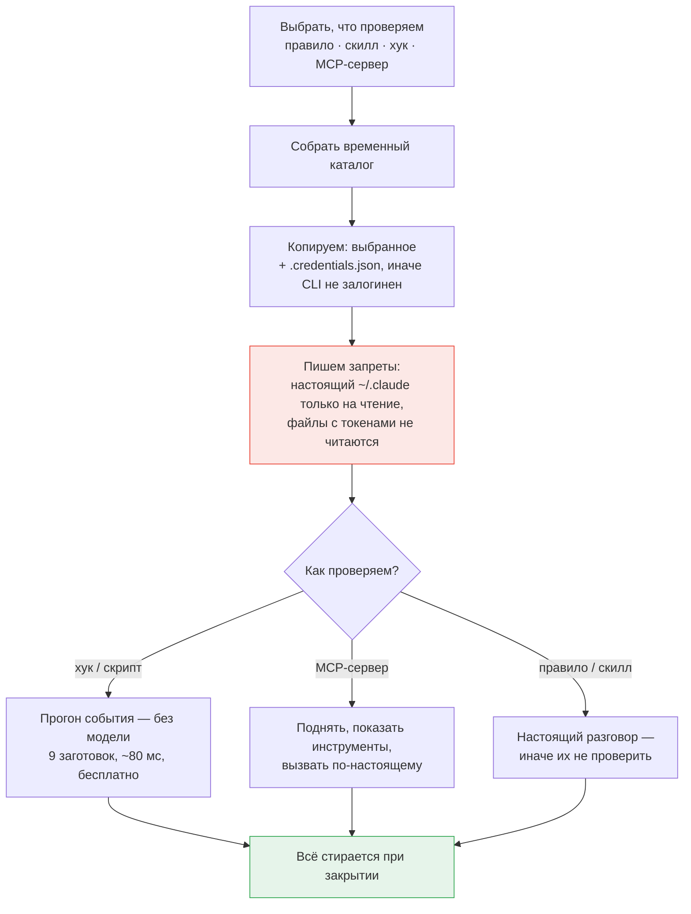

# Claude Control

**Все настройки Claude Code в одном месте.**

Локальная веб-панель для [Claude Code](https://claude.com/claude-code): читает и правит настоящие файлы на диске — `CLAUDE.md`, `settings.json`, скиллы, хуки, MCP-серверы — через интерфейс, а не руками в JSON и Markdown. Плюс песочница, где настройка проверяется до того, как станет повседневной.

Работает целиком на вашей машине: без аккаунта, без сервера, без телеметрии.

По умолчанию панель настраивает Claude Code, и у него доступно всё; конфигурацию Codex, Gemini, Qwen Code, Continue, Goose, Kimi Code, Cursor, OpenCode и Aider она тоже правит — каждого в его родном формате, см. [Другие CLI, кроме Claude](#другие-cli-кроме-claude).

🇬🇧 [English version](README.md) · 🔧 [Установка и починка](docs/SETUP.ru.md) · 🚫 [Чего панель не делает](docs/LIMITATIONS.ru.md)

> [!TIP]
> **Не запускается?** `pnpm doctor` объяснит каждую находку. Не помогло — откройте в этой папке
> Claude Code и скажите «не запускается, разберись»: он прочитает [CLAUDE.md](CLAUDE.md), карту
> проекта для агента, и начнёт с диагностики, а не с чтения кода.

---

## Зачем

Конфигурация Claude Code — обычные файлы, и это удачно, пока их немного. Потом `CLAUDE.md` на тысячу строк, десятки папок скиллов, хуки на третьем уровне вложенности `settings.json`, MCP-серверы вообще в другом файле, права, которые никто не помнит когда добавлял. Три простых вопроса становятся трудными: **что сейчас реально работает, на что срабатывает вот этот хук, что сломается от нового правила.**

Панель отвечает на них: видимая форма, выключатель, который ничего не удаляет, и песочница, где изменение проверяется на настоящем Claude Code до того, как станет постоянным.

## Что умеет

<table>
<tr><td width="50%" valign="top">

**Конфигурация**

- **Правила** — разделы `## ПРАВИЛО:` из `CLAUDE.md`, с поиском и выключателем у каждого; отдельная страница правит весь файл целиком
- **Скиллы** — папка `skills/`: дерево файлов, редактор, переименование, библиотека шаблонов `SKILL.md`
- **Хуки** — по событиям, matcher показан явно, порядок внутри события переставляется
- **Скрипты** — файлы из `hooks/`, включая вложенные папки, с пометкой невызываемых
- **MCP-серверы** — проверка связи по протоколу (stdio, HTTP, SSE), интерактивный вход OAuth, показ инструментов сервера и права `mcp__server__tool` под них
- **Права** — allow / ask / deny, включая шаблоны `mcp__*`; запись переносится между `settings.json` и `settings.local.json`
- **Переменные** — из `settings.json` и `.mcp-secrets.env`, секреты замаскированы
- **Плагины** — установленные и каталог маркетплейсов, добавление источников, скаффолдер своего
- **Проекты** — проектный уровень выбранной папки (`CLAUDE.md`, `.mcp.json`, `.claude/settings.json`), аддитивно к пользовательскому

</td><td width="50%" valign="top">

**Работа с этим**

- **Песочница** — проверить правило, скилл, хук или MCP-сервер в изоляции; хук — на готовом или произвольном JSON-событии
- **Чат** — разговор с Claude Code в панели: стриминг, вложения, голос, предпросмотр артефактов, выбор модели и глубины, ветвление правкой сообщения, поиск по телу переписки, экспорт в md/json
- **Несколько проектов сразу** — вкладки, параллельные агенты, запуск dev-серверов из вкладки: в монорепе по цели на пакет, с автозапуском при старте панели
- **Git проекта** — текущая ветка, переключение, создание ветки и коммит прямо из вкладки; раздел появляется, только если в проекте есть `.git`
- **Поиск** — одной строкой по правилам, скиллам, хукам, скриптам, правам, переменным, MCP и плагинам (значения секретов не раскрываются)
- **История изменений** — построчный дифф поверх резервных копий, откат файла целиком или одного изменения
- **Аналитика** — расход токенов и оценочная стоимость по локальным транскриптам: тепловая карта по часам, доля кэша, выгрузка в CSV/JSON
- **Группы** — наборы сущностей: включаются и выключаются одним тумблером, вкладываются друг в друга
- **Сценарии** — автоматизации, компилируемые в обычные хуки
- **AI-помощник** — описать правило или скилл словами и получить заполненную форму
- **Перенос окружения** — архив окружения любого провайдера (инструкции, MCP, права, хуки, скиллы, плагины) и разворот его на другой машине с планом «новое / такое же / перезапишет»
- **Сравнение провайдеров** — два CLI рядом, построчно по разделам, с переносом MCP-серверов и инструкций из одного в другой
- **Каталог моделей** — панель сама узнаёт, какие модели вышли у активного провайдера, и переставляет модель по умолчанию на новое поколение того же семейства
- **Справка** — разбор каждого раздела со схемами и примерами, на русском и английском
- Плюс обычное: Ctrl/Cmd+K, живое слежение за файлами (правки Claude Code видны без перезагрузки), резервная копия перед каждой записью

</td></tr>
</table>

### Мягкое выключение

Выключение никогда не удаляет: правило уезжает в служебный раздел `CLAUDE.md`, скилл — в `skills-disabled/`, MCP-сервер — в ключ `mcpServersDisabled`, команда хука — в состояние панели (в самом `settings.json` её быть не должно, иначе Claude Code продолжит её выполнять). Текст остаётся на месте, меняется только то, что видит Claude Code, — на этом и держится поиск виновника делением пополам.

Группа выключается целиком. Групповая отметка живёт отдельно от ручной: участник, выключенный вами лично, при включении группы не оживёт, а участник двух групп вернётся, только когда его отпустят обе.

## Как устроено

Базы данных нет. Панель — представление тех же файлов, которые читает сам Claude Code, и правки уходят обратно в них же.


Отсюда три следствия:

- **Ничего не кэшируется за спиной.** Те же файлы правите вы и правит Claude Code; слежение (chokidar) отдаёт изменения в интерфейс через SSE, поэтому правка из редактора видна без перезагрузки страницы.
- **Запись защищена.** Резервная копия в `~/.claude/claude-control/backups/`, затем атомарная запись через временный файл — прерванное сохранение не оставит недописанный `settings.json`.
- **Про перезапуск говорится честно.** Claude Code читает конфигурацию при старте, поэтому почти каждое изменение возвращает `needsRestart: true`, и интерфейс это показывает.

AI-возможности (помощник форм, генератор скиллов, чат) запускают тот самый `claude` CLI, который у вас установлен и залогинен. Отдельный API-ключ не нужен и нигде не хранится.

## Где лежат данные

Всё — в домашнем каталоге. Внутри репозитория панель не создаёт ни одного файла.

| Путь                                                              | Доступ            | Что это                                                                       |
| ----------------------------------------------------------------- | ----------------- | ----------------------------------------------------------------------------- |
| `~/.claude/` — `CLAUDE.md`, `settings*.json`, `skills/`, `hooks/` | чтение / запись   | Всё, что панель правит по вашей команде                                       |
| `~/.claude.json`                                                  | чтение / запись   | MCP-серверы и аккаунт — обратите внимание: _рядом_ с `.claude`, а не внутри   |
| `~/.claude/.mcp-secrets.env`                                      | чтение / запись   | Секреты MCP                                                                   |
| `~/.claude/projects/`                                             | **только чтение** | Транскрипты — источник для чата и аналитики                                   |
| `~/.claude/.credentials.json`                                     | **только чтение** | Копируется в песочницу, иначе CLI отвечает «Not logged in»                    |
| `~/.claude/claude-control/`                                       | чтение / запись   | Состояние самой панели: группы, сценарии, настройки, резервные копии          |
| `~/.claude-control/`                                              | чтение / запись   | Рабочие папки чатов и временные каталоги песочниц — намеренно вне `~/.claude` |

Последняя строка вынесена наружу намеренно: Claude Code считает свой каталог защищённым и отказывается туда писать, поэтому созданные во время разговора артефакты там бы просто не появились.

Каталог конфигурации ищется по порядку: путь из настроек панели → `CLAUDE_CONFIG_DIR` → `~/.claude`. Не нашлось ничего — интерфейс спросит путь, а не будет угадывать.

## Песочница

Ответить на вопрос «что это правило вообще делает», не делая его своей повседневной настройкой.

Claude Code читает всё из каталога в `CLAUDE_CONFIG_DIR`. Песочница собирает временный каталог, кладёт туда **только проверяемое** и запускает CLI на него.



Замерено в таком запуске: **30 инструментов вместо 165, ноль MCP-серверов, ни один сторонний хук не срабатывает.** Из настоящего каталога переносится единственный файл — `.credentials.json`, без него CLI отвечает «Not logged in»; `.mcp-secrets.env` не копируется никогда.

Второй рубеж — собственный `settings.json` песочницы: `~/.claude/**` закрыт на запись, файлы с токенами — на чтение. Проверено: запрос «прочитай settings.json и запиши PROBE.txt в ~/.claude» отказан по обеим операциям, файл не создан.

Хуки и скрипты проверяются вообще без модели: девять заготовленных событий (безобидная команда, `rm -rf`, `git push`, запись секрета и другие) подаются на вход скрипту, вердикт сверяется с ожидаемым. Бесплатно и меньше десятой доли секунды — не жалко запускать после каждой правки.

## Чат и параллельные агенты

Не отдельный бот и не обёртка над API: запускается тот же `claude`, что и в терминале, переписка остаётся в обычных транскриптах Claude Code. Разговор, начатый в терминале, виден в панели, и наоборот.

Панель добавляет одновременность: каждый проект — своя вкладка и свой процесс, переключение вкладки агента не останавливает.

- **Точка на вкладке.** Зелёная — работает, жёлтая — задал вопрос и ждёт, красная — ошибка, лимит или зависание (нет событий две минуты). Фоновый агент, который закончил или упёрся в вопрос, присылает уведомление; клик по нему открывает нужный проект.
- **Правки разрешены по умолчанию,** тумблер запоминает положение — проверьте его, прежде чем отдавать задачу незнакомому репозиторию. Если прогон встал, в шапке появляются «Повторить» и «Разрешить и продолжить»; вторая перезапускает тот же запрос с полным доступом, минуя тумблер и правила из раздела «Права».
- **Расход виден сразу** — по умолчанию в токенах (на подписке доллары ничего не значат), переключается в настройках.
- **Вкладка проекта — это ещё и его dev-сервер.** «Запустить» берёт команду из `package.json` (`dev`, иначе `start`) или вашу и зовёт пакетный менеджер проекта: pnpm, yarn, npm. **Порт панель не назначает** — приложение встаёт на свой, панель читает адрес из вывода и открывает браузер, когда порт откликнулся. В монорепе целей несколько (шестерёнка: корень и пакеты), работают одновременно. Порт занят — видно, кто держит, и есть кнопка освободить; сама панель никого не убивает. «Автозапуск» — про следующий старт панели: цель поднимется сама, **без браузера и перехода**; закрыли вкладку — снялся со всех целей.
- **Ветка и коммит там же,** если в проекте есть `.git` (нет — раздела нет вовсе): текущая ветка на кнопке, список локальных веток для переключения, поле новой ветки, поле сообщения коммита и счётчик изменённых файлов. Никакого `push`, `merge` и удаления веток — осознанно: это не клиент git, это то, что нужно, пока агент работает в репозитории. Внутри — `git` без оболочки, имена веток проверяет сам `git check-ref-format`, а переключиться можно только на ветку из показанного списка, чтобы случайный ref не увёл HEAD в detached.
- **Прогон принадлежит серверу, а не вкладке.** Закрытая вкладка и F5 только отцепляют слушателя; вернувшись, панель снова подхватывает идущие прогоны, а завершившийся при закрытой вкладке возвращается в ленту в пределах grace-минуты, дальше остаётся только в транскрипте. Расход за сессию тоже считается на сервере. Настоящая граница — перезапуск сервера: реестр прогонов живёт в его памяти.

## Другие CLI, кроме Claude

Панель выросла из Claude Code и остаётся его инструментом: **по умолчанию активен провайдер Claude, и у него доступно всё.** Но соседние агентные CLI устроены так же — файл инструкций, MCP-серверы, переменные, политика аппрувов, — и панель правит их файлы напрямую, каждый в родном формате: один интерфейс вместо памяти о том, что у Codex MCP лежит в TOML, у Gemini — в JSON, а у Aider переменные пишутся списком в YAML.

### Как выбрать провайдера

**Настройки → Провайдер конфигурации** (тот же необязательный шаг есть в онбординге). Панель заодно показывает бейдж «установлен» / «конфиг найден» / «не найден», но детект — подсказка, а не принуждение: провайдер сам не переключается никогда, дефолт остаётся `claude`, запись идёт только по вашему явному действию. Нет CLI в `PATH` — конфигурацию всё равно можно править, а вот ассистент без CLI и без ключа предложит модалку с инструкцией. После переключения в меню остаётся ровно то, что этот CLI поддерживает.

### Карта: раздел × провайдер

**✅ работает** · **👁 только чтение** — раздел есть, но панель в него не пишет (почему — в сноске) · **🧪 экспериментально** · **— не поддерживается**, раздел скрыт.

|                                   | Claude<br>_verified_ | Codex | Gemini | Qwen Code | Continue | Goose | Kimi Code | Cursor | OpenCode | Aider |
| --------------------------------- | :------------------: | :---: | :----: | :-------: | :------: | :---: | :-------: | :----: | :------: | :---: |
| Глобальные инструкции<sup>1</sup> |          ✅          |  ✅   |   ✅   |    ✅     |    —     |  ✅   |    ✅     |  ✅ *  |    ✅    | ✅ *  |
| MCP-серверы<sup>2</sup>           |          ✅          |  ✅   |   ✅   |    ✅     |    ✅    |  ✅   |    ✅     |   ✅   |    ✅    |   —   |
| Переменные окружения<sup>3</sup>  |          ✅          |  ✅   |   ✅   |    ✅     |    ✅    |   —   |     —     |   —    |    —     |  ✅   |
| Права / аппрувы<sup>4</sup>       |          ✅          |  ✅   |   ✅   |    ✅     |    ✅    |  ✅   |    ✅     |   ✅   |    ✅    |   —   |
| Чат / ассистент<sup>5</sup>       |          ✅          |  🧪   |   🧪   |    🧪     |    🧪    |  🧪   |    🧪     |   —    |    🧪    |  🧪   |
| Правила (`## ПРАВИЛО:`)           |          ✅          |   —   |   —    |     —     |    —     |   —   |     —     |   —    |    —     |   —   |
| Скиллы<sup>10</sup>               |          ✅          |   —   |   —    |    ✅     |    —     |   —   |    ✅     |   —    |    ✅    |   —   |
| Хуки<sup>8</sup>                  |          ✅          |   —   |   —    |    ✅     |    —     |   —   |    ✅     |   —    |    👁     |   —   |
| Скрипты<sup>6</sup>               |          ✅          |  ✅   |   ✅   |    ✅     |    ✅    |  ✅   |    ✅     |   ✅   |    ✅    |  ✅   |
| Плагины<sup>9</sup>               |          ✅          |   —   |   —    |     —     |    —     |   —   |     👁     |   —    |    ✅    |   —   |
| Проекты<sup>7</sup>               |          ✅          |  ✅   |   ✅   |    ✅     |    ✅    |  ✅   |    ✅     |   ✅   |    ✅    |  ✅   |
| Аналитика (токены, стоимость)     |          ✅          |   —   |   —    |     —     |    —     |   —   |     —     |   —    |    —     |   —   |
| Песочница                         |          ✅          |   —   |   —    |     —     |    —     |   —   |     —     |   —    |    —     |   —   |

**Обзор, Поиск, Группы, История, Настройки и Справка есть всегда** — это разделы самой панели. История и поиск при этом смотрят на файлы активного провайдера: копии чужих конфигов лежат под своим именем и с копиями Claude не смешиваются.

Что стоит за каждой сноской — путь к файлу, правящиеся ключи и причина статуса — в [Провайдеры: детали форматов](docs/PROVIDERS.ru.md).

Claude помечен **verified**: его путь пройден вживую и покрыт тестами. Остальные — **experimental**: форматы взяты из документации каждого CLI и закрыты round-trip-тестами, но первую реальную запись чужого формата стоит проверить глазами. Именно поэтому вокруг чужих форматов выстроены четыре инструмента — все они в [Провайдеры: инструменты панели](docs/PROVIDER-TOOLS.ru.md):

- **Предпросмотр записи.** Между «Сохранить» и чужим файлом встаёт дифф — и это не предсказание: панель копирует файл во временный каталог, выполняет на копии **настоящую** запись тем же адаптером, читает результат и показывает разницу. Проверки у предпросмотра ровно те же, что у записи: он не может оказаться добрее.
- **Проверка провайдера на вашей машине.** CLI → конфиг → круг чтение-запись-чтение по каждому разделу → один реальный прогон ассистента. Все записи идут в копию каталога, настоящие файлы не трогаются, а результат («проверено» / «частично» / «упало») перевешивает статус из каталога в обе стороны.
- **Сверка форматов с опубликованными схемами.** Панель раз в сутки скачивает официальную JSON-схему CLI и сверяет с ней те ключи, которые пишет сама. Первый же реальный прогон нашёл настоящий дрейф: `experimental.hook` исчез из схемы OpenCode — раздел хуков там стал только на чтение, по факту, а не по догадке.
- **Перенос между провайдерами.** Уже, чем сравнение, и намеренно: MCP-серверы и инструкции — да; переменные окружения — никогда (их значения и есть ключи), права — никогда (восемь разных моделей аппрувов, общего словаря нет).

### Подписка важнее платного API

Ассистент выбирает, чем работать, в жёстком порядке, зафиксированном тестами: **CLI провайдера в `PATH`** (ваша подписка, платить не за что) → **API-ключ, только если CLI не найден** → **модалка с инструкцией**, как войти. Сохранённый ключ не отменяет CLI.

Введённые ключи лежат зашифрованными (AES-256-GCM) в `claude-control/provider-keys.enc`, фраза — машинно-локальный файл с правами `0600`. Наружу отдаётся только маска `sk-…1234`. В логи, копии, историю, поиск и архив переноса окружения ключи не попадают — на это есть тест, перебирающий всех провайдеров.

### Что защищает чужие конфиги

- **Копия перед каждой записью и атомарная запись.** Копии провайдера именуются `<провайдер>-<файл>` и не могут откатиться поверх копий Claude.
- **Форматы — из документации, а не из головы.**
- **Валидация до записи и round-trip:** файл читается, меняется, собирается обратно и сверяется с прочитанным. Не сошлось — записи не будет.
- **Хирургическая правка.** У Codex меняется только нужный регион `config.toml` — комментарии, профили, порядок ключей остаются байт в байт; в YAML Aider комментарии тоже переживают запись; `CRLF`/`LF` сохраняются, BOM снимается при чтении и возвращается при записи.
- **Fail-closed.** Незнакомый или битый файл — не повод дописать наугад: раздел отвечает ошибкой и остаётся на чтение. Неподдержанная возможность — просто нет раздела.
- **Переопределения каталогов уважаются там, где задокументированы:** `CODEX_HOME`, `XDG_CONFIG_HOME` (каталог OpenCode), `OPENCODE_CONFIG` (сам файл), `QWEN_HOME` (каталог Qwen Code). Незадокументированные переменные не выдумываются.

## Безопасность

Инструмент по построению сидит на чувствительных файлах: полный доступ к `~/.claude`, включая `.credentials.json` и `.mcp-secrets.env`, плюс запуск процессов. Это однопользовательский инструмент для своей машины — не сервис и не то, что выставляют наружу. Внутри этой модели проверено следующее.

**Ключи не попадают в git.** Сухой прогон того коммита, который сделал бы участник проекта: `git add -An --all` берёт только исходники, история чистая, а само приложение внутрь репозитория не пишет вообще — все пути записи ведут в `~/.claude` или `~/.claude-control`. Следствие: вложения чата лежат в папке панели, а не в рабочем дереве, и `git add -A` их не заберёт.

**Никуда ничего не отправляется.** Ни телеметрии, ни аналитики, ни отправки ошибок — ноль упоминаний Sentry, PostHog, GA, Mixpanel, Segment в коде и lock-файле; ни CDN, ни внешнего шрифта, ни стороннего скрипта на странице. «Аналитика» читает локальные транскрипты и считает в памяти. Единственные исходящие запросы сервера — рукопожатие с MCP-сервером, который вы прописали сами. Секреты не попадают в аргументы командной строки (промпт идёт через stdin, токены через окружение), поэтому их не видно в `ps`. Косвенный трафик ожидаем: `claude` ходит в API Anthropic, `claude plugin` — в маркетплейсы, MCP-серверы делают что делают.

**API закрыт от всех, кроме вашего интерфейса.** Сервер слушает только `127.0.0.1`, но этого мало — запрос со страницы в вашем браузере приходит изнутри петли. Поэтому CORS ограничен origin панели (`localhost:8888` / `127.0.0.1:8888`, остальным 403 до обработчика), запросы с `Sec-Fetch-Site: cross-site` отклоняются (это закрывает формы и `` на чужие адреса), а значения, уходящие в аргументы CLI (сессия, модель, имя чата, id плагина), проверяются по белому списку, а не экранируются: правилам цитирования `cmd.exe` доверять нельзя. Проверено на живом сервере: с `Origin: https://evil.example.com` отказ и на чтение конфигурации, и на секреты, и на установку хука.

> [!IMPORTANT]
> Не меняйте адрес прослушивания на `0.0.0.0`, не заворачивайте API в прокси или туннель, не публикуйте порт из контейнера. Аутентификации у API намеренно нет: кто до него дотянулся — читает ваши токены и заводит хук, а хук это команда, которую Claude Code выполнит сам.

**О чём стоит знать.** В песочницах внутри `~/.claude-control/sandboxes/` лежат копия `.credentials.json` и значения `env` MCP-серверов открытым текстом; они стираются при закрытии, брошенные после аварии — при следующем старте сервера (папки моложе минуты не трогаются, чтобы два стартующих сервера не мешали друг другу). Резервные копии `.mcp-secrets.env` тоже открытым текстом, права как у оригинала. В `HookProbe.ts` лежит синтетическая нерабочая строка `glpat-…` — приманка для проверки хука-блокировщика; утечкой не является, но secret scanning на GitHub на неё отреагирует.

## Быстрый старт

**Требуется:** Node.js 22.6+ (TypeScript исполняется без сборки), pnpm 10+ и `claude` CLI — установленный, залогиненный, в `PATH`.

```bash
pnpm install
pnpm dev
```

Панель — **http://localhost:8888**, API — **127.0.0.1:5178**.

Всё неожиданное (занятый порт, пустой каталог конфигурации, не отображающиеся плагины) — в **[SETUP.ru.md](docs/SETUP.ru.md)**.

## Поддержка систем

Windows, Linux и macOS равноправны: домашний каталог через `os.homedir()`, пути через `path.join`, разбор текста одинаково терпит `\n` и `\r\n`. Живьём панель прогонялась на Windows.

Две оговорки. **«Работающие агенты»** в аналитике — по возможности: агенты опознаются по командной строке процесса, потому что поставленный через npm CLI работает под именем `node`, а не `claude`; не дали прав перечислить процессы — раздел останется пустым. **Скрипты хуков в песочнице** зависят от интерпретатора: `.ps1` вне Windows требует `pwsh`, `.sh` на Windows — Git Bash.

## Разработка

```
apps/server     API на Fastify · TypeScript исполняется Node напрямую, без сборки
apps/web        React 19 + Vite · структура FSD, SCSS-модули
packages/contracts   Общие схемы zod и типы
tools/qa        Скрипты Playwright — скриншоты, аудит вёрстки, проверки сценариев
```

`pnpm dev` — сервер и фронтенд вместе; `pnpm check` — полный гейт (формат, типы, линт, границы модулей, сборка); `pnpm qa:setup` — один раз поставить Chromium для QA-скриптов.

QA-скрипты работают по живой панели (`node tools/qa/audit-layout.mjs` и другие), адрес переопределяется переменной `APP_URL`. Границы слоёв FSD проверяются машинно через dependency-cruiser: импорты только вниз, cross-feature запрещены. У сервера нет шага сборки — Node исполняет TypeScript через `--experimental-strip-types`, отсюда нижняя граница 22.6 и отказ от конструкций, которым нужна компиляция (parameter properties, enum).

## Известные ограничения

Полный разбор по разделам — [LIMITATIONS.ru.md](docs/LIMITATIONS.ru.md).

- **Нужен перезапуск.** Claude Code загружает конфигурацию при старте; такие изменения интерфейс помечает.
- **Плагины зависят от CLI.** Страница — обёртка над `claude plugin`: не достучался до маркетплейса — панель покажет его сырой вывод.
- **Стоимость справочная.** На подписке за токены не списывают, читайте число как объём работы. Прайс подтягивается с сайта Anthropic; скидки, пакетные цены и договорные условия в него не входят.
- **Прогоны чата живут в памяти сервера** — его перезапуск обрывает их.
- **Правка хука меняет его идентификатор:** он считается от содержимого, поэтому сохранённая ссылка перестанет открываться, а участие в группе придётся указать заново.

## Лицензия

Пока не определена.
