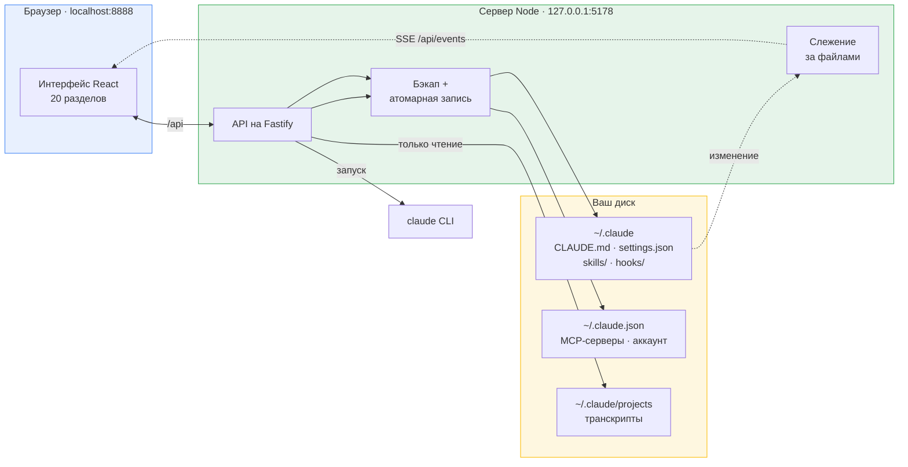
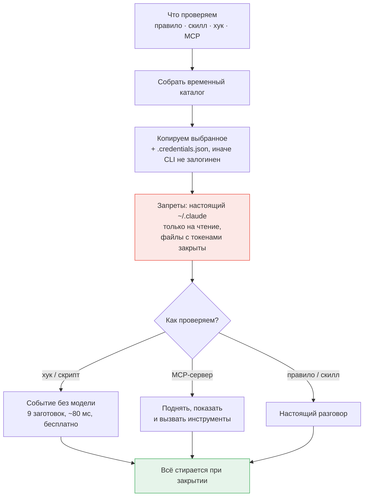

# Claude Control

**Все настройки Claude Code в одном месте.**

Локальная веб-панель для [Claude Code](https://claude.com/claude-code): читает и правит настоящие файлы на диске — `CLAUDE.md`, `settings.json`, скиллы, хуки, MCP-серверы — через интерфейс, а не руками в JSON и Markdown. Плюс песочница, где настройка проверяется до того, как станет повседневной.

Работает целиком на вашей машине: без аккаунта, без сервера, без телеметрии.

По умолчанию панель настраивает Claude Code, и у него доступно всё; конфигурацию Codex, Gemini, Qwen Code, Continue, Goose, Kimi Code, Cursor, OpenCode и Aider она тоже правит — каждого в его родном формате, см. [Другие CLI, кроме Claude](#другие-cli-кроме-claude).

🇬🇧 [English version](README.md) · 🔧 [Установка и починка](docs/SETUP.ru.md) · 💬 [Чат и параллельные агенты](docs/CHAT.ru.md) · 👥 [Группы](docs/GROUPS.ru.md) · 🚫 [Чего панель не делает](docs/LIMITATIONS.ru.md)

> [!TIP]
> **Не запускается?** `pnpm doctor` объяснит каждую находку. Не помогло — откройте в этой папке
> Claude Code и скажите «не запускается, разберись»: он прочитает [CLAUDE.md](CLAUDE.md), карту
> проекта для агента, и начнёт с диагностики, а не с чтения кода.

---

## Зачем

Конфигурация Claude Code — обычные файлы, и это удачно, пока их немного. Потом `CLAUDE.md` на тысячу строк, десятки папок скиллов, хуки на третьем уровне вложенности `settings.json`, MCP-серверы в другом файле, права, которые никто не помнит когда добавлял. Три простых вопроса становятся трудными: **что сейчас реально работает, на что срабатывает вот этот хук, что сломается от нового правила.**

Панель отвечает на них: видимая форма, выключатель, который ничего не удаляет, и песочница, где изменение проверяется на настоящем Claude Code до того, как станет постоянным.

## Что умеет

<table>
<tr><td width="50%" valign="top">

**Конфигурация**

- **Правила** — разделы `## ПРАВИЛО:` из `CLAUDE.md` с поиском и выключателем у каждого; отдельная страница правит файл целиком
- **Скиллы** — папка `skills/`: дерево файлов, редактор, переименование, библиотека шаблонов `SKILL.md`
- **Команды** — всё, что вызывается через `/`, одним списком: скиллы, файлы команд, плагины, встроенные команды CLI — с описанием, владельцем и переходом к правке
- **Хуки** — по событиям, matcher показан явно, порядок внутри события переставляется
- **Скрипты** — файлы из `hooks/` вместе с вложенными папками, невызываемые помечены
- **MCP-серверы** — проверка связи по протоколу (stdio, HTTP, SSE), вход OAuth, инструменты сервера и права `mcp__server__tool` под них
- **Права** — allow / ask / deny, включая шаблоны `mcp__*`; запись переносится между `settings.json` и `settings.local.json`
- **Переменные** — из `settings.json` и `.mcp-secrets.env`, секреты замаскированы
- **Плагины** — установленные и каталог маркетплейсов, добавление источников, скаффолдер своего
- **Проекты** — проектный уровень выбранной папки (`CLAUDE.md`, `.mcp.json`, `.claude/settings.json`) поверх пользовательского

</td><td width="50%" valign="top">

**Работа с этим**

- **Песочница** — проверить правило, скилл, хук или MCP-сервер в изоляции; хук — на готовом или своём JSON-событии
- **Чат** — разговор с Claude Code в панели: стриминг, вложения, голос, предпросмотр артефактов, выбор модели и глубины, ветвление правкой сообщения, поиск, экспорт в md/json
- **Несколько проектов сразу** — вкладки, параллельные агенты, dev-серверы из вкладки: в монорепе по цели на пакет, с автозапуском при старте панели
- **Параллельные ветки** — кнопкой завести рабочую копию репозитория под ветку (`git worktree`) рядом с проектом и открыть её обычной вкладкой: три агента на трёх ветках не мешают друг другу, копия с работающим агентом не удаляется, слияния в панели нет вовсе
- **Разделение задач** — на список независимых задач агент предлагает разбивку карточкой: «делать здесь по очереди» или «разделить на N чатов», и тогда каждой группе достаются своя ветка, своя копия и свой чат
- **Продолжение в чистой сессии** — закрыв задачу, агент прибирает свои рабочие файлы и предлагает продолжить в новом разговоре: дорогой контекст остаётся позади, а новая сессия читает файл-опору. По кнопке — или само, если включить автопродолжение в этом разговоре
- **Git проекта** — ветка, изменённые файлы, переключение, создание ветки, коммит, `pull` и `push` прямо из вкладки; раздел есть, только если в проекте есть `.git`
- **С телефона** — приложение для Android/iOS (`apps/mobile`) поверх того же API: весь чат, файлы и диффы проекта на чтение, `push`, вся аналитика; сопряжение один раз по QR, связь — по вашей собственной сети Tailscale
- **Поиск** — одной строкой по правилам, скиллам, хукам, скриптам, правам, переменным, MCP и плагинам (значения секретов не раскрываются)
- **История изменений** — построчный дифф поверх резервных копий, откат файла целиком или одного изменения
- **Аналитика** — расход токенов и оценочная стоимость по локальным транскриптам: тепловая карта по часам, доля кэша, выгрузка в CSV/JSON
- **Группы** — наборы сущностей: включаются одним тумблером, вкладываются друг в друга, привязываются к проекту (начали в нём работу — группа включилась сама) и хранят порядок работы, который собирается в обычный скилл с хуком-триггером. Подробно — [Группы: наборы, привязка и порядок работы](docs/GROUPS.ru.md)
- **Сценарии** — автоматизации, компилируемые в обычные хуки
- **AI-помощник** — описать правило или скилл словами и получить заполненную форму
- **Перенос окружения** — архив окружения любого провайдера (инструкции, MCP, права, хуки, скиллы, плагины) и разворот на другой машине с планом «новое / такое же / перезапишет»
- **Сравнение провайдеров** — два CLI рядом, построчно по разделам, с переносом MCP-серверов и инструкций
- **Каталог моделей** — панель узнаёт, какие модели вышли у активного провайдера, и переставляет модель по умолчанию на новое поколение того же семейства
- **Свой эндпоинт** — адрес модели вместо облака вендора (локальная модель, шлюз компании, прокси): профиль заводится один раз и раскладывается по переменным окружения CLI кнопкой; токен по умолчанию в чужой конфиг не пишется
- **Защита данных** — локальный прокси между CLI и моделью: видит тело каждого запроса (промпт, прочитанные файлы, вывод инструментов), заменяет найденное меткой `[ИМЯ_1]` с возвратом в ответе или отклоняет запрос; находит ровно то, что описано правилами
- **Гейт на промпте** — готовый хук `UserPromptSubmit` на тех же правилах: отклоняет или помечает промпт до отправки, без прокси; видит только набранное руками и текст не заменяет — событие не позволяет
- **Справка** — разбор каждого раздела со схемами и примерами, на русском и английском
- Плюс обычное: Ctrl/Cmd+K, живое слежение за файлами (правки Claude Code видны без перезагрузки), резервная копия перед каждой записью

</td></tr>
</table>

### Мягкое выключение

Выключение никогда не удаляет: правило уезжает в служебный раздел `CLAUDE.md`, скилл — в `skills-disabled/`, MCP-сервер — в ключ `mcpServersDisabled`, команда хука — в состояние панели (в `settings.json` её быть не должно, иначе Claude Code продолжит её выполнять). Текст остаётся на месте, меняется только то, что видит Claude Code, — на этом и держится поиск виновника делением пополам.

Группа выключается целиком, и групповая отметка живёт отдельно от ручной: выключенный вами лично участник от включения группы не оживёт, а участник двух групп вернётся, только когда его отпустят обе.

## Как устроено

Базы данных нет. Панель — представление тех же файлов, которые читает сам Claude Code, и правки уходят обратно в них же.



Отсюда три следствия:

- **Ничего не кэшируется за спиной.** Одни и те же файлы правите вы и правит Claude Code; слежение (chokidar) отдаёт изменения в интерфейс через SSE, поэтому правка из редактора видна без перезагрузки страницы.
- **Запись защищена.** Резервная копия в `~/.claude/claude-control/backups/`, затем атомарная запись через временный файл: прерванное сохранение не оставит недописанный `settings.json`.
- **Про перезапуск говорится честно.** Claude Code читает конфигурацию при старте, поэтому почти каждое изменение возвращает `needsRestart: true`, и интерфейс это показывает.

AI-возможности (помощник форм, генератор скиллов, чат) запускают тот самый `claude`, который у вас установлен и залогинен. Отдельный API-ключ не нужен и нигде не хранится.

## Где лежат данные

Всё — в домашнем каталоге. Внутри репозитория панель не создаёт ни одного файла.

| Путь                                                              | Доступ            | Что это                                                                       |
| ----------------------------------------------------------------- | ----------------- | ----------------------------------------------------------------------------- |
| `~/.claude/` — `CLAUDE.md`, `settings*.json`, `skills/`, `hooks/` | чтение / запись   | Всё, что панель правит по вашей команде                                       |
| `~/.claude.json`                                                  | чтение / запись   | MCP-серверы и аккаунт — обратите внимание: _рядом_ с `.claude`, а не внутри   |
| `~/.claude/.mcp-secrets.env`                                      | чтение / запись   | Секреты MCP                                                                   |
| `~/.claude/projects/`                                             | **только чтение** | Транскрипты — источник для чата и аналитики                                   |
| `~/.claude/.credentials.json`                                     | **только чтение** | Копируется в песочницу, иначе CLI отвечает «Not logged in»                    |
| `~/.claude/claude-control/`                                       | чтение / запись   | Состояние самой панели: группы, сценарии, настройки, резервные копии          |
| `~/.claude-control/`                                              | чтение / запись   | Рабочие папки чатов и временные каталоги песочниц — намеренно вне `~/.claude` |

Последняя строка вынесена наружу намеренно: Claude Code считает свой каталог защищённым и писать туда отказывается — артефакты разговора там бы просто не появились.

Каталог конфигурации ищется по порядку: путь из настроек панели → `CLAUDE_CONFIG_DIR` → `~/.claude`. Не нашлось ничего — интерфейс спросит путь, а не станет угадывать.

## Песочница

Ответить на вопрос «что это правило вообще делает», не делая его повседневной настройкой. Claude Code читает всё из каталога в `CLAUDE_CONFIG_DIR`, поэтому песочница собирает временный каталог, кладёт туда **только проверяемое** и запускает CLI на него.



Замерено в таком запуске: **30 инструментов вместо 165, ноль MCP-серверов, ни один сторонний хук не срабатывает.** Из настоящего каталога переносится единственный файл — `.credentials.json`, без него CLI отвечает «Not logged in»; `.mcp-secrets.env` не копируется никогда.

Второй рубеж — собственный `settings.json` песочницы: `~/.claude/**` закрыт на запись, файлы с токенами — на чтение. Проверено: запрос «прочитай settings.json и запиши PROBE.txt в ~/.claude» отказан по обеим операциям, файл не создан.

Хуки и скрипты проверяются вообще без модели: девять заготовленных событий (безобидная команда, `rm -rf`, `git push`, запись секрета и другие) подаются скрипту на вход, вердикт сверяется с ожидаемым. Бесплатно и меньше десятой доли секунды — не жалко запускать после каждой правки.

## Чат и параллельные агенты

Не отдельный бот и не обёртка над API: запускается тот же `claude`, что и в терминале, переписка остаётся в обычных транскриптах Claude Code — разговор, начатый в терминале, виден в панели, и наоборот.

Панель добавляет одновременность: каждый проект — своя вкладка и свой процесс, переключение вкладки агента не останавливает.

- **Точка на вкладке** — работает, ждёт ответа или встал; фоновый агент, который закончил или упёрся в вопрос, шлёт уведомление. Тумблер правок, расход в токенах, dev-сервер проекта и его git — в той же вкладке.
- **Ветка на агента** — рабочая копия репозитория (`git worktree`) рядом с проектом, открытая обычной вкладкой; копию с работающим агентом удалить нельзя, слияния в панели нет вовсе.
- **Разбивка списка задач по чатам** и **продолжение в чистой сессии** — агент предлагает карточкой, решение и кнопка ваши.
- **Прогон принадлежит серверу, а не вкладке** — F5 и закрытая вкладка ничего не останавливают.

Подробно — [Чат, вкладки и параллельные агенты](docs/CHAT.ru.md).

## Другие CLI, кроме Claude

Панель выросла из Claude Code и остаётся его инструментом: **по умолчанию активен провайдер Claude, и у него доступно всё.** Соседние агентные CLI устроены так же — файл инструкций, MCP-серверы, переменные, политика аппрувов, — и панель правит их файлы напрямую, каждый в родном формате: один интерфейс вместо памяти о том, что у Codex MCP лежит в TOML, у Gemini — в JSON, а у Aider переменные идут списком в YAML.

### Как выбрать провайдера

**Настройки → Провайдер конфигурации** (тот же необязательный шаг есть в онбординге). Бейдж «установлен» / «конфиг найден» / «не найден» — подсказка, а не принуждение: сам провайдер не переключается никогда, дефолт остаётся `claude`, запись идёт только по вашему явному действию. Нет CLI в `PATH` — конфигурацию всё равно можно править, а ассистент без CLI и без ключа предложит инструкцию. После переключения в меню остаётся ровно то, что этот CLI поддерживает.

### Карта: раздел × провайдер

Что именно работает у каждого CLI — таблица «раздел × провайдер» в [Чего панель не делает у других CLI](docs/LIMITATIONS-PROVIDERS.ru.md#карта-раздел--провайдер). Пути к файлам, правящиеся ключи и причина каждого статуса — в [Провайдеры: детали форматов](docs/PROVIDERS.ru.md).

Claude здесь единственный **verified**: его путь пройден вживую и покрыт тестами. Остальные — **experimental**: форматы взяты из документации каждого CLI и закрыты round-trip-тестами, но первую реальную запись стоит проверить глазами. Поэтому вокруг них четыре инструмента — предпросмотр записи, проверка провайдера на вашей машине, ежесуточная сверка с опубликованными схемами и перенос настроек между CLI ([Провайдеры: инструменты панели](docs/PROVIDER-TOOLS.ru.md)). Не теория: первый же прогон сверки нашёл дрейф — `experimental.hook` исчез из схемы OpenCode, и раздел хуков там стал только на чтение по факту, а не по догадке.

### Подписка важнее платного API

Ассистент выбирает, чем работать, в жёстком порядке, зафиксированном тестами: **CLI провайдера в `PATH`** (ваша подписка, платить не за что) → **API-ключ, только если CLI не найден** → **модалка с инструкцией**, как войти. Сохранённый ключ не отменяет CLI. Сами ключи лежат зашифрованными (AES-256-GCM) в `claude-control/provider-keys.enc`, фраза — машинно-локальный файл с правами `0600`; наружу отдаётся только маска `sk-…1234`, и ни в логи, ни в копии, ни в историю, ни в архив переноса окружения ключ не попадает (тест по всем провайдерам).

### Что защищает чужие конфиги

- **Копия перед каждой записью и атомарная запись.** Копии провайдера именуются `<провайдер>-<файл>` и не могут откатиться поверх копий Claude.
- **Форматы — из документации, а не из головы**, включая переопределения каталога (`CODEX_HOME`, `XDG_CONFIG_HOME`, `OPENCODE_CONFIG`, `QWEN_HOME`).
- **Round-trip до записи:** файл читается, меняется, собирается обратно и сверяется с прочитанным. Не сошлось — записи не будет.
- **Хирургическая правка.** У Codex меняется только нужный регион `config.toml`: комментарии, профили и порядок ключей байт в байт; в YAML Aider комментарии тоже переживают запись; `CRLF`/`LF` сохраняются, BOM снимается при чтении и возвращается при записи.
- **Fail-closed.** Незнакомый или битый файл — не повод дописать наугад: раздел отвечает ошибкой и остаётся на чтение. Неподдержанная возможность — просто нет раздела.

## Безопасность

Инструмент по построению сидит на чувствительных файлах: полный доступ к `~/.claude`, включая `.credentials.json` и `.mcp-secrets.env`, плюс запуск процессов. Это однопользовательский инструмент для своей машины — не сервис и не то, что выставляют наружу. В этой модели проверено:

**Ключи не попадают в git.** Сухой прогон коммита, который сделал бы участник проекта: `git add -An --all` берёт только исходники, история чистая, а внутрь репозитория приложение не пишет вообще — все пути записи ведут в `~/.claude` или `~/.claude-control`. Поэтому и вложения чата лежат в папке панели: `git add -A` их не заберёт.

**Никуда ничего не отправляется.** Ни телеметрии, ни аналитики, ни отправки ошибок: ноль упоминаний Sentry, PostHog, GA, Mixpanel, Segment в коде и lock-файле, ни CDN, ни внешнего шрифта, ни стороннего скрипта на странице. «Аналитика» читает локальные транскрипты и считает в памяти. Единственный исходящий запрос сервера — рукопожатие с MCP-сервером, который вы прописали сами. Секреты не идут в аргументы командной строки (промпт через stdin, токены через окружение), поэтому не видны в `ps`. Косвенный трафик ожидаем: `claude` ходит в API Anthropic, `claude plugin` — в маркетплейсы, MCP-серверы делают что делают.

**API закрыт от всех, кроме вашего интерфейса.** Слушать только `127.0.0.1` мало — запрос со страницы в вашем браузере приходит изнутри петли. Поэтому CORS ограничен origin панели (`localhost:8888` / `127.0.0.1:8888`, остальным 403 до обработчика), запросы с `Sec-Fetch-Site: cross-site` отклоняются (закрывает формы и `` на чужие адреса), а значения, уходящие в аргументы CLI (сессия, модель, имя чата, id плагина), проверяются по белому списку, а не экранируются: правилам цитирования `cmd.exe` доверять нельзя. Проверено вживую: с чужим `Origin` отказано и на чтение конфигурации, и на секреты, и на установку хука.

**Удалённый доступ — единственное исключение, и до включения его нет.** Включённый, он отвечает на запрос не со своего origin только при Bearer-токене, выданном на этой машине: тот показывается один раз QR-кодом для телефона, обратно из API не возвращается, отзывается пересозданием. Адрес прослушивания не меняется — туннель (Tailscale Serve) заканчивается на самой машине и проксирует в `127.0.0.1`: наружу ничего не публикуется, второй системы аккаунтов нет.

> [!IMPORTANT]
> Не меняйте адрес прослушивания на `0.0.0.0`, не публикуйте порт из контейнера, не ставьте перед API прокси, снимающий проверку токена. С выключенным удалённым доступом аутентификации у API намеренно нет: кто до него дотянулся — читает ваши токены и заводит хук, а хук это команда, которую Claude Code выполнит сам. С включённым единственная преграда — этот токен: держите его внутри своей сети Tailscale и пересоздавайте, как только устройство потерялось.

**О чём стоит знать.** В песочницах внутри `~/.claude-control/sandboxes/` лежат копия `.credentials.json` и значения `env` MCP-серверов открытым текстом; они стираются при закрытии, брошенные после аварии — при следующем старте сервера (папки моложе минуты не трогаются, чтобы два стартующих сервера не мешали друг другу). Копии `.mcp-secrets.env` тоже открытым текстом, права как у оригинала. В `HookProbe.ts` лежит синтетическая нерабочая строка `glpat-…` — приманка для проверки хука-блокировщика: не утечка, но secret scanning на GitHub на неё отреагирует.

## Быстрый старт

**Требуется:** Node.js 22.6+ (TypeScript исполняется без сборки), pnpm 10+ и `claude` CLI — установленный, залогиненный, в `PATH`.

```bash
pnpm install
pnpm dev
```

Панель — **http://localhost:8888**, API — **127.0.0.1:5178**.

Для телефона: включите удалённый доступ в настройках, поднимите `pnpm remote` (ставит Tailscale Serve перед API и печатает адрес), отсканируйте QR в приложении, `pnpm remote:off` — снять. Само приложение — `apps/mobile`: `pnpm mobile` собирает и ставит его на подключённое устройство или эмулятор, `pnpm mobile:apk` кладёт релизный APK в корень репозитория (нужен Android 12+). Tailscale должен быть установлен и залогинен под вашим аккаунтом; без него панель так и скажет, а не станет угадывать адрес.

Всё неожиданное (занятый порт, пустой каталог конфигурации, пропавшие плагины) — в **[SETUP.ru.md](docs/SETUP.ru.md)**.

## Поддержка систем

Windows, Linux и macOS равноправны: домашний каталог через `os.homedir()`, пути через `path.join`, разбор текста одинаково терпит `\n` и `\r\n`. Живьём панель прогонялась на Windows.

Две оговорки. **«Работающие агенты»** в аналитике — по возможности: агенты опознаются по командной строке процесса, потому что поставленный через npm CLI работает под именем `node`, а не `claude`; нет прав перечислить процессы — раздел пуст. **Скрипты хуков в песочнице** зависят от интерпретатора: `.ps1` вне Windows требует `pwsh`, `.sh` на Windows — Git Bash.

## Разработка

```
apps/server     API на Fastify · TypeScript исполняется Node напрямую, без сборки
apps/web        React 19 + Vite · структура FSD, SCSS-модули
apps/mobile     Expo + React Native · своя цепочка сборки (npm, не workspace pnpm)
packages/contracts   Общие схемы zod и типы
tools/qa        Скрипты Playwright — скриншоты, аудит вёрстки, проверки сценариев
```

`pnpm dev` — сервер и фронтенд вместе; `pnpm check` — полный гейт (формат, типы, линт, границы модулей, сборка); `pnpm qa:setup` — один раз поставить Chromium для QA-скриптов. `pnpm keepalive:install` ставит сторожа: он раз в 20 секунд проверяет оба порта и поднимает ту половину стенда, которая замолчала (`pnpm keepalive:status`, `pnpm keepalive:off`) — полезно, если стенд живёт часами и его подчищает системный уборщик процессов.

Телефон живёт отдельной цепочкой: `pnpm mobile` — сборка и установка на устройство, `pnpm mobile:type-check` — типы, `pnpm mobile:apk` — релизный APK в корень репозитория. Промежуточные файлы нативной сборки Gradle складывает внутрь `node_modules/<пакет>/android/{build,.cxx}` — около 10 ГБ за сборку, которых нет ни в APK, ни в репозитории, — поэтому `pnpm mobile:apk` стирает их сам (`--keep-build` оставит ради быстрой пересборки, `pnpm mobile:clean` уберёт вручную).

QA-скрипты работают по живой панели (`node tools/qa/audit-layout.mjs` и другие), адрес — в `APP_URL`. Границы слоёв FSD проверяет машинно dependency-cruiser: импорты только вниз, cross-feature запрещены. У сервера нет шага сборки — Node исполняет TypeScript через `--experimental-strip-types`, отсюда нижняя граница 22.6 и отказ от конструкций, которым нужна компиляция (parameter properties, `enum`).

## Известные ограничения

Полный разбор по разделам — [LIMITATIONS.ru.md](docs/LIMITATIONS.ru.md).

- **Нужен перезапуск.** Claude Code загружает конфигурацию при старте; такие изменения интерфейс помечает.
- **Плагины зависят от CLI.** Страница — обёртка над `claude plugin`: не достучался до маркетплейса — панель покажет его сырой вывод.
- **Стоимость справочная.** На подписке за токены не списывают, читайте число как объём работы. Прайс с сайта Anthropic; скидки, пакетные цены и договорные условия в него не входят.
- **Прогоны чата живут в памяти сервера** — его перезапуск обрывает их.
- **Правка хука меняет его идентификатор:** он считается от содержимого, поэтому сохранённая ссылка перестанет открываться, а участие в группе придётся указать заново.

## Лицензия

[PolyForm Perimeter 1.0.1](LICENSE) — можно свободно использовать, изменять и распространять: дома
и на работе, внутри компании и в коммерческих проектах; достаточно сохранить строку Required
Notice. Запрещено единственное — делать на основе панели конкурирующий с ней продукт. Гарантий нет.

Это source-available лицензия, а не одобренная OSI открытая. В ранних коммитах лежал файл `LICENSE`
с MIT — на те снимки разрешение сохраняется.
