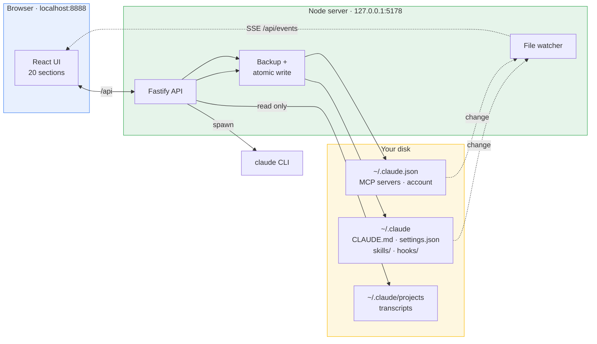
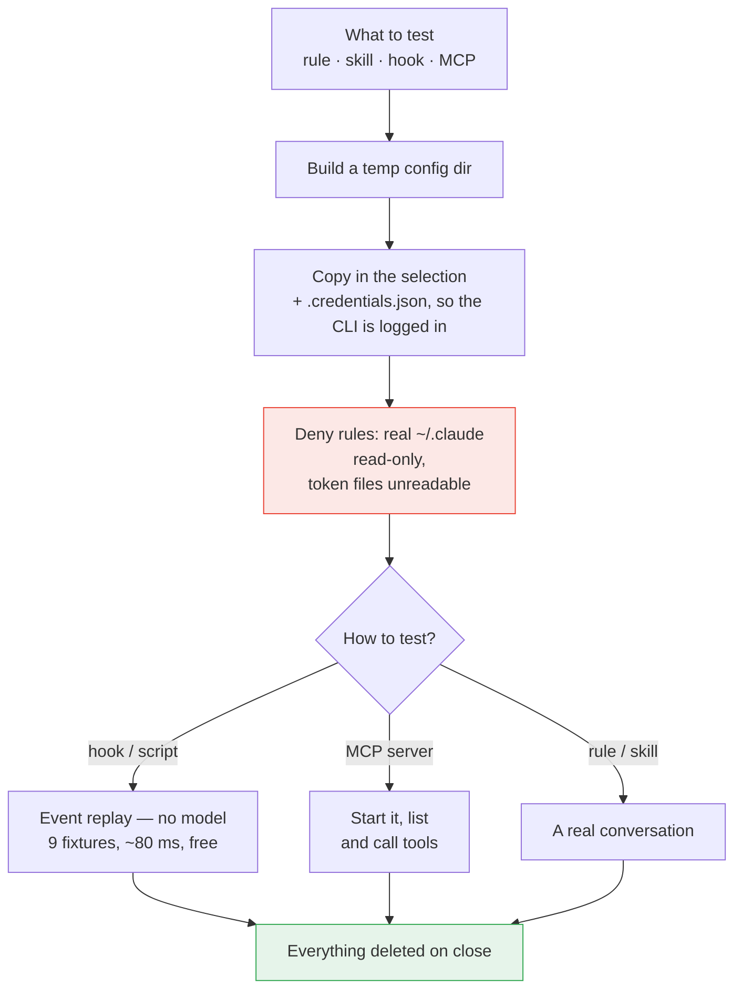

# How it works

The two halves of the panel, the source of truth on disk, and the sandbox where a change is tested before it becomes your daily setup.

🇷🇺 [Русская версия](ARCHITECTURE.ru.md) · 📖 [What this project is](../README.md) · 🔒 [Security](SECURITY.md) · 🧑‍💻 [Development](DEVELOPMENT.md)

---

## Contents

- [How it works](#how-it-works)
- [Where your data lives](#where-your-data-lives)
- [The sandbox](#the-sandbox)

---

## How it works

There is no database. The panel is a view over the files Claude Code already reads, and edits go back to those same files.

Three things follow:

- **Nothing is cached behind your back.** You and Claude Code edit those same files; a watcher (chokidar) pushes changes to the UI over SSE, so an edit made in your editor shows up without a refresh.
- **Writes are defensive.** A backup into `~/.claude/claude-control/backups/`, then an atomic write through a temp file — an interrupted save cannot leave a half-written `settings.json`.
- **Restart is honest.** Claude Code reads its configuration at startup, so almost every mutation returns `needsRestart: true` and the UI says so.

The AI features (form assistant, skill generator, chat) shell out to the `claude` CLI you already have installed and logged in. No API key to configure, none stored anywhere.

## Where your data lives

Everything is under your home directory. The panel creates no files inside the repository.

| Path                                  | Access        | What it is                                                  |
| ------------------------------------- | ------------- | ----------------------------------------------------------- |
| `~/.claude/CLAUDE.md`                 | read / write  | Rules                                                       |
| `~/.claude/settings.json`             | read / write  | Hooks, permissions, env                                     |
| `~/.claude/settings.local.json`       | read / write  | The same, personal — tagged "local"                         |
| `~/.claude/skills/`                   | read / write  | Skills                                                      |
| `~/.claude/skills-disabled/`          | read / write  | Disabled skills                                             |
| `~/.claude/hooks/`                    | read / write  | Hook scripts                                                |
| `~/.claude.json`                      | read / write  | MCP servers, account (note: _beside_ `.claude`, not inside) |
| `~/.claude/.mcp-secrets.env`          | read / write  | MCP secrets                                                 |
| `~/.claude/projects/`                 | **read only** | Transcripts — the source for chat and analytics             |
| `~/.claude/.credentials.json`         | **read only** | Copied into a sandbox so the CLI is logged in               |
| `~/.claude/claude-control/state.json` | read / write  | The panel's own state: groups, automations, settings        |
| `~/.claude/claude-control/backups/`   | write         | Timestamped backups                                         |
| `~/.claude-control/chats/`            | read / write  | Working folders for chats started in the panel              |
| `~/.claude-control/sandboxes/`        | read / write  | Temporary sandbox config and working dirs                   |

The last two sit outside `~/.claude` deliberately: Claude Code treats its own directory as protected and refuses to write there, so chat artifacts would silently fail to appear.

Configuration root discovery, in order: the path set in the panel's Settings → `CLAUDE_CONFIG_DIR` → `~/.claude`. If none resolves, the UI asks instead of guessing.

## The sandbox

Answering "what does this rule actually do?" without making it your daily setup.

Claude Code reads everything from the directory named by `CLAUDE_CONFIG_DIR`. The sandbox builds a temporary directory, puts **only the thing under test** into it, and launches the CLI pointed at that directory.

Measured in such a run: **30 tools instead of 165, zero MCP servers, and not one third-party hook fires.** The only thing carried over from the real directory is `.credentials.json` — without it the CLI answers "Not logged in"; `.mcp-secrets.env` is never copied.

A second line of defence is the sandbox's own `settings.json`: `~/.claude/**` denied for writing, token files denied for reading. Verified in practice — a prompt asking Claude to read `settings.json` and write `PROBE.txt` into `~/.claude` was refused on both counts, and no file appeared.

Hooks and scripts are tested with no model at all: nine prepared events (a harmless command, `rm -rf`, `git push`, a secret being written, and so on) are replayed straight at the script and the verdict compared against what the fixture expects. Free, under a tenth of a second — practical to run on every edit.
