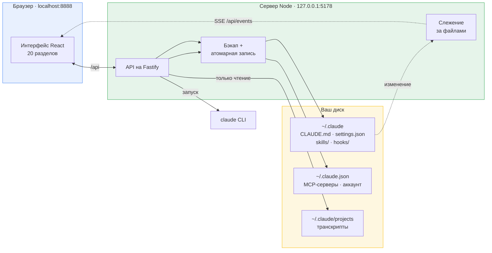
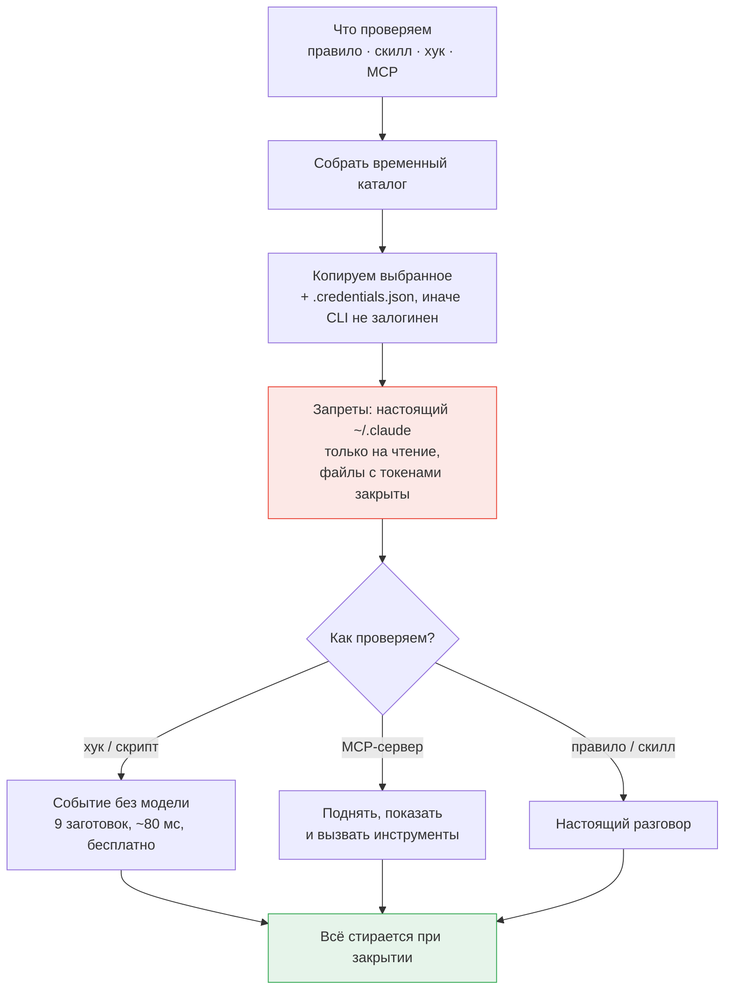

# Как устроено

Две половины панели, источник правды на диске и песочница, в которой настройка проверяется до того, как станет повседневной.

🇬🇧 [English version](ARCHITECTURE.md) · 📖 [Описание проекта](../README.ru.md) · 🔒 [Безопасность](SECURITY.ru.md) · 🧑‍💻 [Разработка](DEVELOPMENT.ru.md)

---

## Содержание

- [Как устроено](#как-устроено)
- [Где лежат данные](#где-лежат-данные)
- [Песочница](#песочница)

---

## Как устроено

Базы данных нет. Панель — представление тех же файлов, которые читает сам Claude Code, и правки уходят обратно в них же.

Отсюда три следствия:

- **Ничего не кэшируется за спиной.** Одни и те же файлы правите вы и правит Claude Code; слежение (chokidar) отдаёт изменения в интерфейс через SSE, поэтому правка из редактора видна без перезагрузки страницы.
- **Запись защищена.** Резервная копия в `~/.claude/claude-control/backups/`, затем атомарная запись через временный файл: прерванное сохранение не оставит недописанный `settings.json`.
- **Про перезапуск говорится честно.** Claude Code читает конфигурацию при старте, поэтому почти каждое изменение возвращает `needsRestart: true`, и интерфейс это показывает.

AI-возможности (помощник форм, генератор скиллов, чат) запускают тот самый `claude`, который у вас установлен и залогинен. Отдельный API-ключ не нужен и нигде не хранится.

## Где лежат данные

Всё — в домашнем каталоге. Внутри репозитория панель не создаёт ни одного файла.

| Путь                                                              | Доступ            | Что это                                                                       |
| ----------------------------------------------------------------- | ----------------- | ----------------------------------------------------------------------------- |
| `~/.claude/` — `CLAUDE.md`, `settings*.json`, `skills/`, `hooks/` | чтение / запись   | Всё, что панель правит по вашей команде                                       |
| `~/.claude.json`                                                  | чтение / запись   | MCP-серверы и аккаунт — обратите внимание: _рядом_ с `.claude`, а не внутри   |
| `~/.claude/.mcp-secrets.env`                                      | чтение / запись   | Секреты MCP                                                                   |
| `~/.claude/projects/`                                             | **только чтение** | Транскрипты — источник для чата и аналитики                                   |
| `~/.claude/.credentials.json`                                     | **только чтение** | Копируется в песочницу, иначе CLI отвечает «Not logged in»                    |
| `~/.claude/claude-control/`                                       | чтение / запись   | Состояние самой панели: группы, сценарии, настройки, резервные копии          |
| `~/.claude-control/`                                              | чтение / запись   | Рабочие папки чатов и временные каталоги песочниц — намеренно вне `~/.claude` |

Последняя строка вынесена наружу намеренно: Claude Code считает свой каталог защищённым и писать туда отказывается — артефакты разговора там бы просто не появились.

Каталог конфигурации ищется по порядку: путь из настроек панели → `CLAUDE_CONFIG_DIR` → `~/.claude`. Не нашлось ничего — интерфейс спросит путь, а не станет угадывать.

## Песочница

Ответить на вопрос «что это правило вообще делает», не делая его повседневной настройкой. Claude Code читает всё из каталога в `CLAUDE_CONFIG_DIR`, поэтому песочница собирает временный каталог, кладёт туда **только проверяемое** и запускает CLI на него.

Замерено в таком запуске: **30 инструментов вместо 165, ноль MCP-серверов, ни один сторонний хук не срабатывает.** Из настоящего каталога переносится единственный файл — `.credentials.json`, без него CLI отвечает «Not logged in»; `.mcp-secrets.env` не копируется никогда.

Второй рубеж — собственный `settings.json` песочницы: `~/.claude/**` закрыт на запись, файлы с токенами — на чтение. Проверено: запрос «прочитай settings.json и запиши PROBE.txt в ~/.claude» отказан по обеим операциям, файл не создан.

Хуки и скрипты проверяются вообще без модели: девять заготовленных событий (безобидная команда, `rm -rf`, `git push`, запись секрета и другие) подаются скрипту на вход, вердикт сверяется с ожидаемым. Бесплатно и меньше десятой доли секунды — не жалко запускать после каждой правки.
